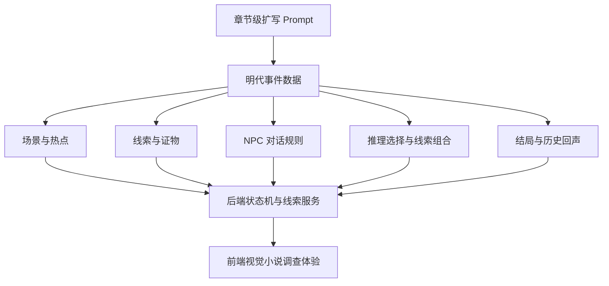

## User Requirements

用户希望基于 `docs/PRD.md` 与 `docs/periodPrompt/` 现有阶段 Prompt，新增一版更强的“剧本体量扩写 Prompt”。当前《史隙》主 Demo 剧本偏短，需要通过新的执行 Prompt 指挥后续模型把明代 / 书坊学徒 / 书坊焚稿案扩写到类似《山河旅探》第一章《无妄之祸》的章节级推理游戏剧本效果。

## Product Overview

新增 Prompt 要让《史隙》的主线不再只是短流程演示，而是具备完整章节推理体验：有强钩子开场、危机卷入、回忆或前情、现场调查、证据收集、NPC 盘问、出示证据、思维疑团、连续推理选择、反转、最终指证、多结局与历史回声。

## Core Features

- 输出一个可直接交给执行模型使用的“章节级剧本扩写 Prompt”。
- 明确要求扩写明代书坊焚稿案，而不是重写整个产品或扩展北宋、晚唐完整主线。
- 规定剧本结构：主要角色、隐藏关系、序幕、调查操作、证物获得、NPC 盘问、推理选择、证据链、真相动机、结局回收。
- 规定体量标准：更多场景、子场景、调查热点、线索证物、出示证据反应、推理选择和剧情台词。
- 保留历史悬疑和视觉小说风格，所有用户可见文本必须为中文。
- 强调剧本必须可玩、可验证，不能只是长篇散文。
- 保留项目规则：阶段推进、关键线索释放、结局判定由后端规则控制，AI 只负责表达、润色和氛围增强。

## Tech Stack Selection

- 文档形态：Markdown 阶段 Prompt，放入现有 `docs/periodPrompt/` 目录。
- 项目约束：复用现有《史隙》文档体系、阶段 Prompt 写法和全局规则。
- 参考对象：
- `docs/PRD.md`：产品定位、主 Demo 范围、故事结构和玩法目标。
- `docs/periodPrompt/00_global_rules.md`：全局禁止事项、中文化、AI 与 Key 安全规则。
- `docs/periodPrompt/02_stage_1_mock_demo_prompt.md`：Mock Demo 的阶段 Prompt 格式。
- `docs/periodPrompt/06_stage_5_state_and_clue_prompt.md`：状态机与线索规则约束。
- `docs/periodPrompt/10_stage_9_endings_and_history_echo_prompt.md`：多结局与历史回声约束。
- 当前实现背景：明代主线数据集中在 `backend/data/events/ming_bookshop_fire.json`、`backend/data/scenes/ming_bookshop_scenes.json`、`backend/data/clues/ming_bookshop_clues.json`、`backend/data/npcs/ming_bookshop_npcs.json`、`backend/data/mock/dialogues/*.json`、`backend/data/endings/ming_bookshop_endings.json`。

## Implementation Approach

采用“新增独立阶段 Prompt + README 索引更新”的方式，而不是直接改 PRD 或直接扩写游戏数据。新 Prompt 将作为后续执行模型的明确任务书，要求执行模型在现有后端权威状态机、线索系统、NPC 对话规则和结局规则下扩写剧本体量。

关键决策：

- 新增文件建议命名为 `docs/periodPrompt/19_story_volume_expansion_prompt.md`，避免覆盖已有阶段 Prompt。
- 不修改 `docs/PRD.md`，符合全局规则中默认禁止修改 PRD 的约束。
- Prompt 内部必须列出“目标效果”“允许修改范围”“禁止事项”“量化验收标准”“自测步骤”“报告格式”，沿用现有阶段 Prompt 风格。
- 扩写标准以用户给出的《山河旅探》样例为参考，但改造成《史隙》自己的明代书坊焚稿案，不照搬人物、案件和设定。
- 强调可玩节点优先：调查热点、证物、出示证据、推理选择、线索组合、结局条件必须能落入现有数据结构或后续合理扩展的数据结构。

## Implementation Notes

- 控制改动范围：本次只提供 Prompt 文档，不直接改后端 JSON、前端 UI 或 API。
- Prompt 中后续执行范围应限制在明代主线相关数据、Mock 对话、测试和报告，避免扩大到北宋、晚唐完整剧情。
- Prompt 必须提醒执行模型不得让 AI 决定阶段、关键线索或结局。
- Prompt 必须包含中文化审计、ID 引用一致性检查、全结局可达性检查和 API 路线验收。
- Prompt 中不得包含任何 API Key，也不得要求读取或打印密钥。
- 为减少回归，要求执行模型优先扩展已有 JSON 数据结构；若必须新增字段，应同步更新类型、服务解析和测试。

## Architecture Design

本次计划产物是文档级指挥文件，不引入新运行时架构。后续执行模型应遵循现有数据驱动架构：



## Directory Structure

本次计划只新增和更新文档，不直接修改游戏运行数据。

```text
d:/SomeFunnyProjFromGithub/HistoryGame/
└── docs/
    └── periodPrompt/
        ├── 19_story_volume_expansion_prompt.md  # [NEW] 章节级剧本扩写 Prompt。定义如何把明代书坊焚稿案扩写为完整推理章节，包括目标体量、结构模板、允许修改范围、禁止事项、量化验收、自测和报告格式。
        └── README.md                            # [MODIFY] 更新 Prompt 文件清单与推荐用途，说明该 Prompt 用于在已有阶段完成后扩写主 Demo 剧本体量。
```

## Key Code Structures

无需新增代码接口。本次核心产物为 Markdown Prompt。

## Agent Extensions

### Skill

- **brainstorming**
- Purpose: 将用户给出的《山河旅探》章节样例转化为《史隙》可执行的剧本扩写规范。
- Expected outcome: 提炼出章节级推理剧本结构、体量指标和可玩节点要求。

### SubAgent

- **code-explorer**
- Purpose: 复核现有 `docs/periodPrompt/` 风格、主 Demo 数据位置和当前剧本结构。
- Expected outcome: 确保新增 Prompt 的文件路径、允许修改范围、验收标准与项目真实结构一致。