# Internal Space in Phaser 4

Phaser 4 uses a Filter system, which is used for everything from Blur to Mask. Filters operate in one of two spaces: **internal** and **external**. Each space serves a purpose: internal spaces focus on an object, while external spaces focus on the screen.

This can be confusing at first, particularly when you're trying to line up objects to serve as masks. So here's a step-by-step guide for visualizing internal space.

## Cheat Sheet

Here's the really quick summary of internal space.

- It's like drawing on the target's texture.
- The target is effectively untransformed during the process.
- Use the 0-1 space.
- If the target can't provide size information, it defaults to external space.

(These coordinates are normalized. '1' really means 'the width or height, in pixels'.)

## Internal Space, Step By Step

Let's work through an example. We'll show you exactly what's being drawn at each step.

### Example Scene

We use the following code to create our scene:

```js
class Example extends Phaser.Scene
{
    preload ()
    {
        this.load.image('uv', 'assets/pics/uv-grid-diag.png');
        this.load.image('mask', 'assets/pics/splat1.png');
    }

    create ()
    {
        const { width, height } = this.scale;

        const bg = this.add.gradient({
            bands: { colorStart: 0x444488, colorEnd: 0x8866cc },
            direction: Math.PI / 2,
            dither: true
        }, width / 2, height / 2, width, height);

        const maskSprite = this.add.image(0, 0, 'mask')
        .setOrigin(0)
        .setScale(2);

        const uv = this.add.image(width / 2, height / 2 + 256, 'uv')
        .enableFilters()
        .setScale(0.5)
        .setRotation(1);

        uv.filters.internal.addMask(maskSprite);
    }
}

const config = {
    type: Phaser.AUTO,
    width: 1280,
    height: 720,
    backgroundColor: '#304858',
    parent: 'phaser-example',
    scene: Example
};

let game = new Phaser.Game(config);
```

We load the following textures:

`uv-grid-diag.png` (1024x1024):

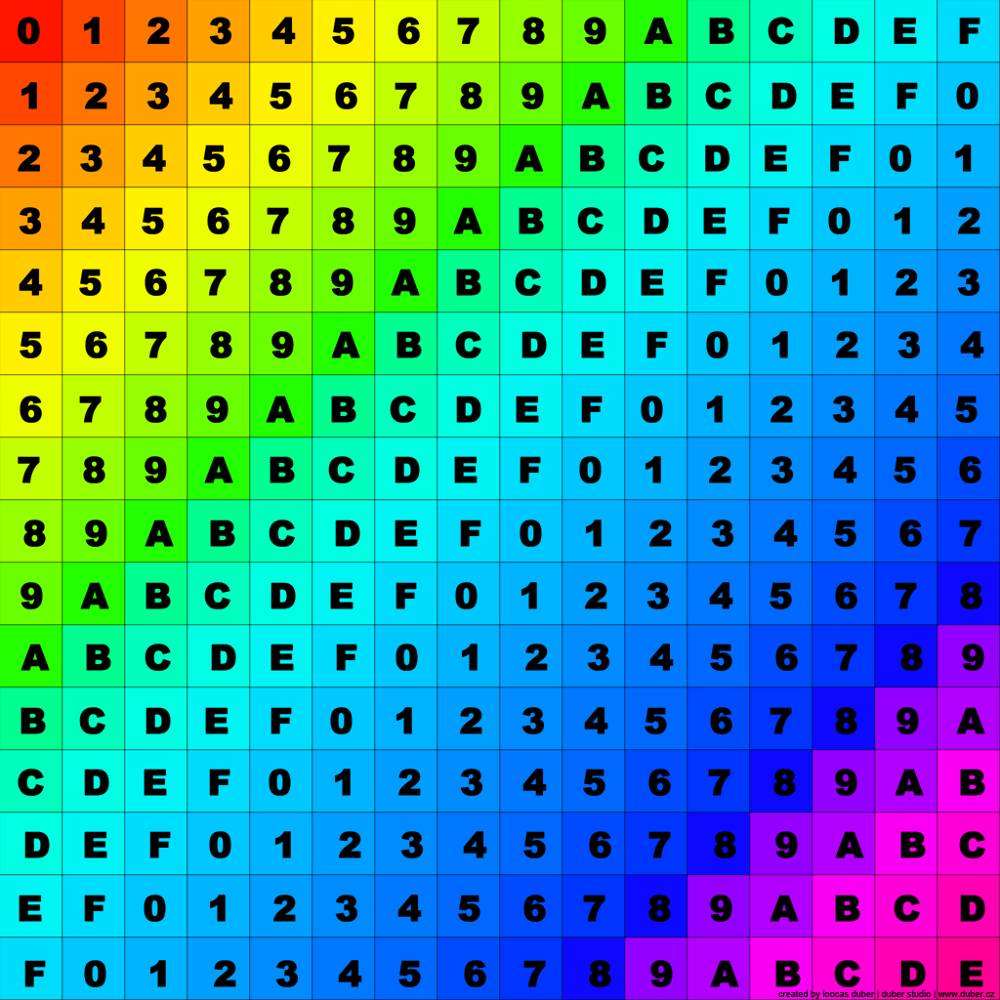

`splat1.png` (665x584):


Note that these textures are not the same size. In particular, the UV grid has been scaled down so it will fit in the game, and then moved slightly off-screen.

The game renders like this:

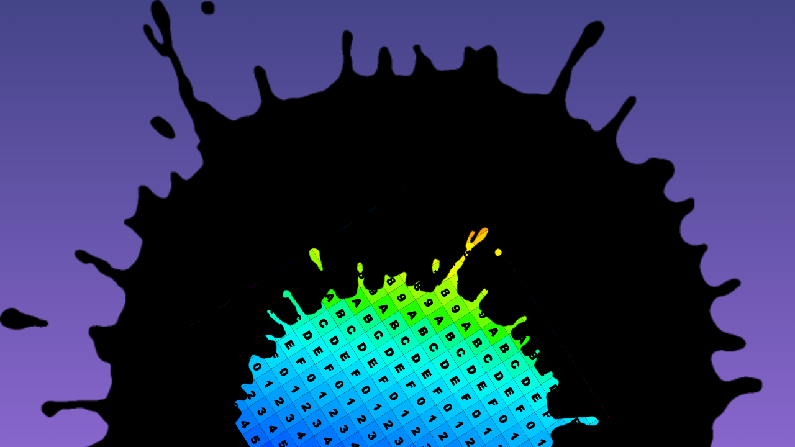

Let's explore how we get there.

### Regular Rendering

If we weren't using a mask, we'd just draw everything onto the screen in its final position. The textures you see above are transformed and drawn to the game canvas, like this:

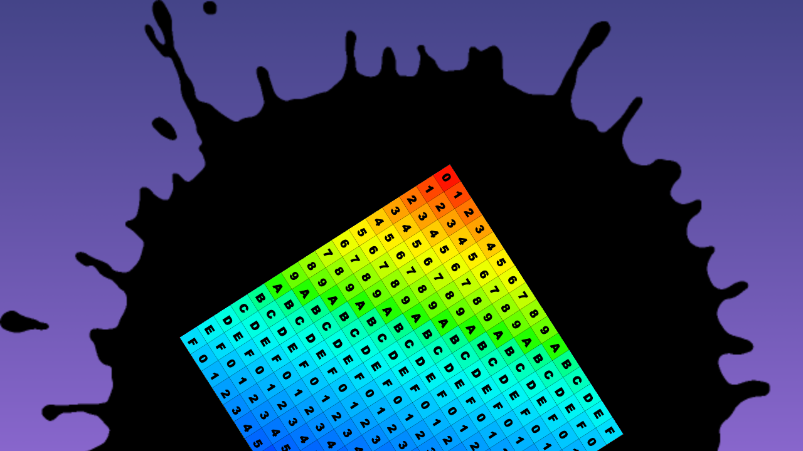

### Internal Space

When we draw filters, such as a mask, we have to use a different canvas called a framebuffer. This lets us draw things without messing up the main canvas.

Before we get to the masked object, we have already taken several draw steps, including clearing the main canvas, drawing a background color, and drawing the gradient and `maskSprite`. The main game canvas is 1280x720.

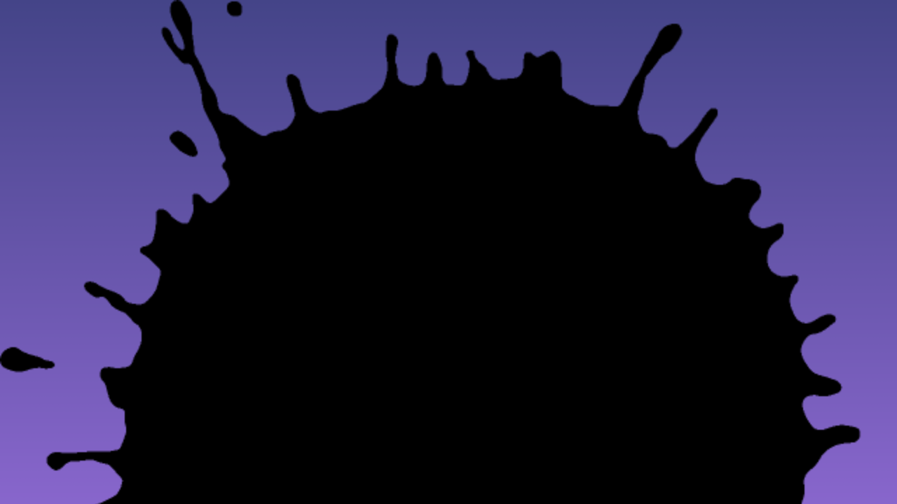

As we start drawing the masked sprite, we 'untransform' it. This removes all scale, rotation, and position, and effectively restores it to its original state. Note that we **center** the sprite at this time! Regardless of origin, we make it all appear inside the framebuffer. This is the 'internal space' where internal filters operate.

It looks just like the original texture, and is 1024x1024, even though the object itself is scaled down:


> This does look exactly like the original, but I took it from a screenshot.

> We actually clear the framebuffer first, but that just looks like an empty framebuffer. We'll skip clear steps in this explanation - just assume that every new framebuffer is cleared before use.

If we stopped here, Phaser would take this texture, transform it back to the sprite's transform, and draw it. It would look just like regular rendering, above, but with the extra step of the framebuffer. But we can't stop here. This is filter country.

### What If: Texture Mask

The simplest way to use a mask is as a texture. What happens if we do that?

Well, we take the result of the last step, and just apply the texture as a mask. But how does it match up? The two textures are different resolutions!

The GL rendering system doesn't care. It treats texture coordinates as 0-1, whatever the source texture. It _stretches_ the texture to match. The result:

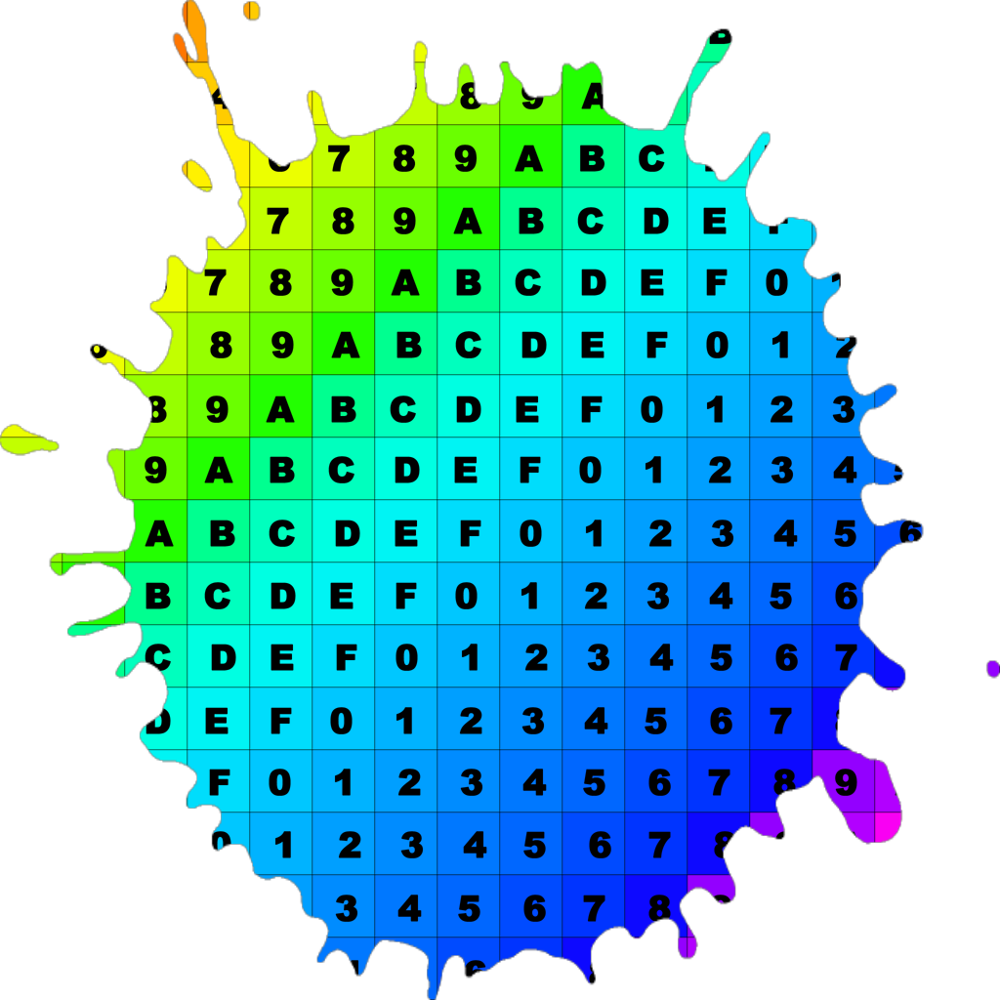

See how the smaller mask texture has been stretched to fit the larger internal space.

Sometimes this automatic fit is not what you want, however. If you're trying to align more complex shapes, you want things to stay the same size. To do that, we use game objects.

### Game Object Mask

When using game objects as masks, we leave them exactly where they are. We keep their current transforms. This allows you to control their transform precisely.

To do this, we draw the game objects through a dedicated camera owned by the mask filter. The draw goes into a fresh framebuffer, so if the game objects are complex (e.g. a Container with lots of child objects, or an object with filters itself), that complexity is resolved by the time we come to use it.

Here, the result is simple: we draw the sprite with whatever transforms we originally gave it. In this case, it's at 0,0, with origin 0,0 and scale 2. The result:

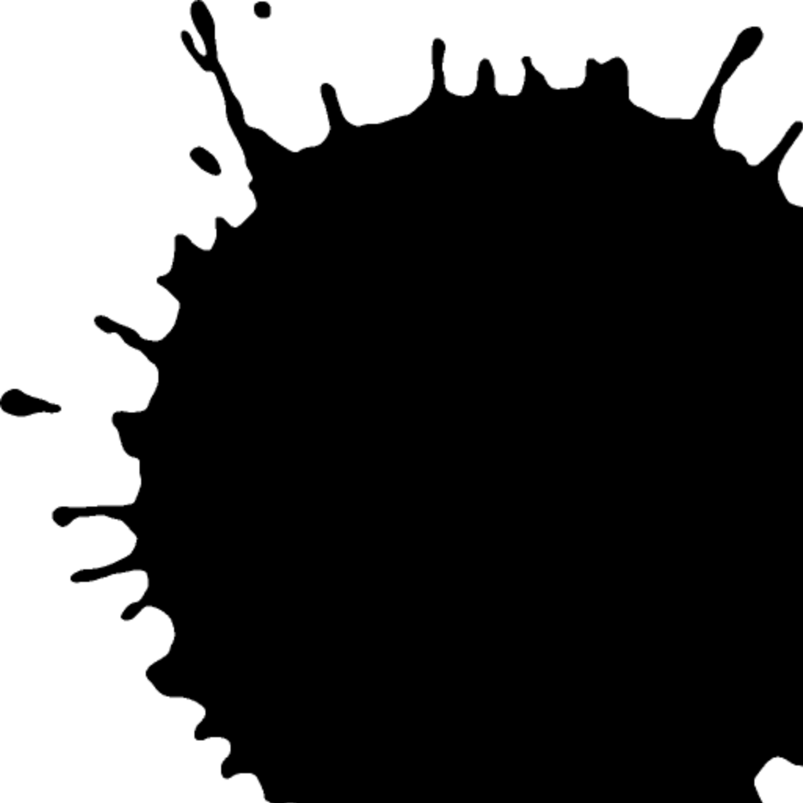

Note that the object doesn't perfectly fit in the internal space any more. It is no longer stretched.

> Technically, this framebuffer will itself be stretched. It just already has the same size as the sprite framebuffer, so it doesn't change size. In some cases you may need to scale the mask framebuffer, e.g. when using very large objects that would create very large framebuffers. Use the Mask filter's `scaleFactor` property to control this.

With the mask texture ready, we now return to the same flow as simple textures: we apply the framebuffer as a mask. The result is drawn to a new framebuffer (we're on our third temporary framebuffer, but don't worry, they get recycled).

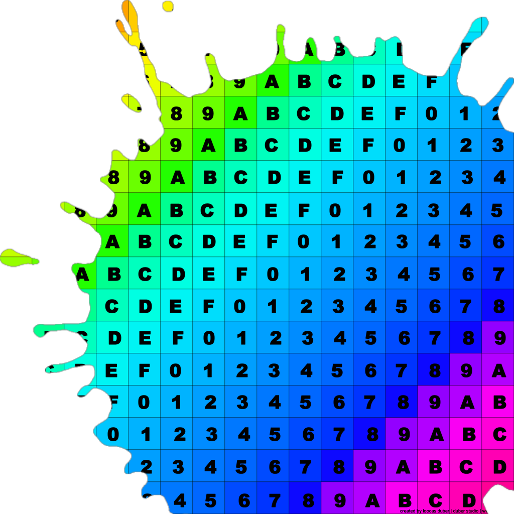

Note how everything stays the same: the mask texture is still going out of bounds, and the base texture hasn't changed size or position.

Finally, we take the masked object's original transform, and use it with the texture from this framebuffer. _Now_ we change size and position, transforming the texture into its final position in the game world.


And we're done!

> The whole output is transformed as a unit. The arms of the splat mask have rotated.

> Note that we drew parts of the sprite that aren't on the screen in the final composite. The purples in the bottom-right corner are completely off screen. Bear this in mind when using filters: the whole internal space is drawn, even if parts of it will eventually go off screen. This can be useful, e.g. when using a blur or displacement filter that needs data from those parts of the framebuffer. Or it can be a performance cost.

### What If: Mask Object Transforms

Note that the mask object has a particular transform. It is at 0,0, its scale is 2, and its origin is 0,0. What happens if we don't apply any of these transforms, and leave it at 0,0?

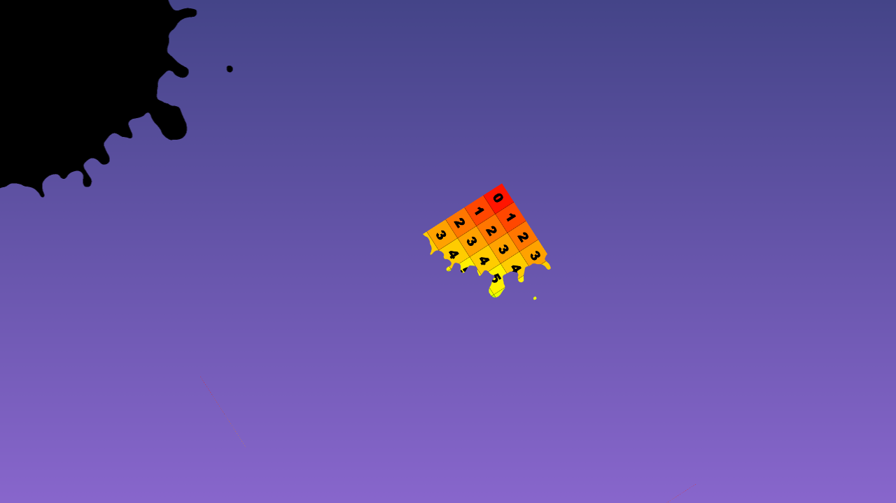

Well, that doesn't look the same at all. What happened?

You can see some clues in the background. The mask object is no longer fully positioned in the 0-1 space. Its center is at 0,0, and most of it is now in negative regions of X, Y, or both. So we can only see a quarter of it on the screen.

The same is true for the mask framebuffer. The game object is drawn over the corner, and most of it is out of view.

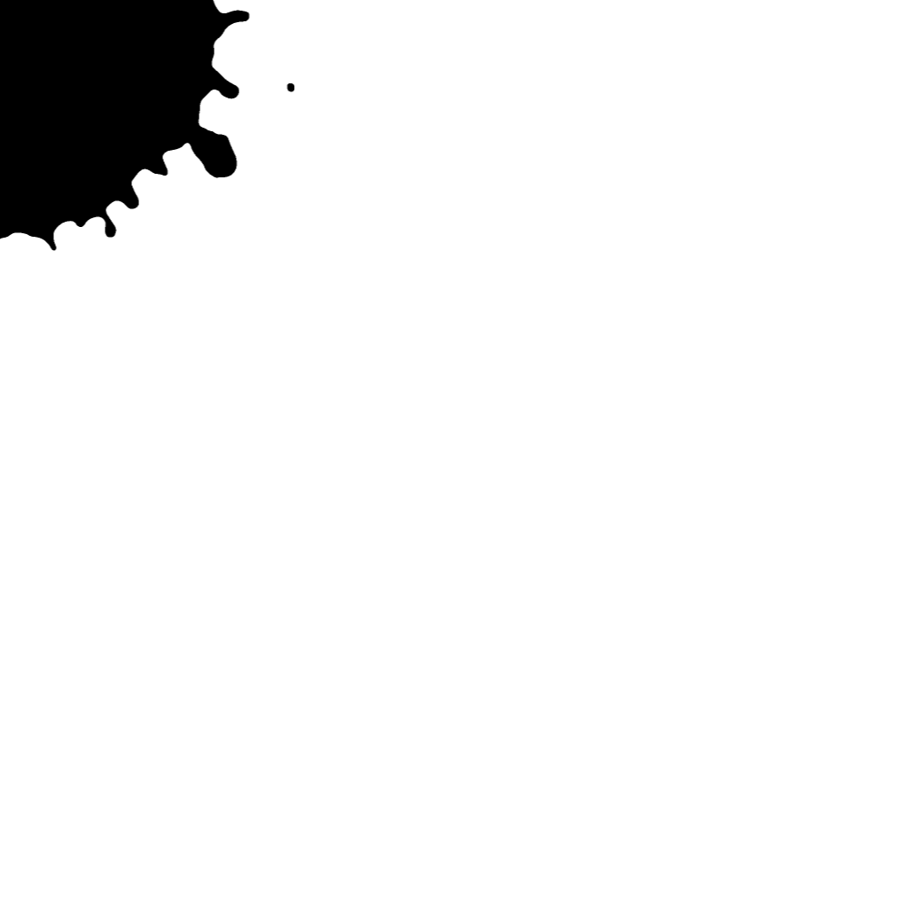

> That's not a small image; it's still 1024x1024. Most of it is just empty.

In general, mask objects should dwell in that 0-1 space, where 1 is the full size of the target object. This simple rule will prevent a lot of headaches.

We designed internal filters this way so that you could easily and precisely control complex masks on moving objects. You don't need to think about syncing the mask to the object! Just use internal space, and you know exactly where the mask is going to go.

You can usually see the internal position of the mask objects just by leaving them visible in the main camera. (Turn `visible` off to hide them during rendering; the Mask will still render an invisible object.) If you move the main camera, this inference is lost, but the rule remains the same: keep mask objects in the 0-1 space.

### External Space

While we're here, let's talk about external space too.

> We typically say that external space is just the screen, or the main camera. This is _usually_ true, but technically it's actually the space of the framebuffer where the sprite was going to be drawn. Which is usually just the screen. But sometimes it's different. For example, if we put a filter on the mask object, it would have two different external contexts! The first appears when it's drawn to the game canvas, and is the size of the screen. The second appears when it's drawn to the internal space framebuffer, and is the size of the target's internal space.

External space doesn't use the target's transforms. It stays where it is, and uses the external context's size.

If we draw a simple texture mask, the texture is stretched to the size of the whole screen. It ignores the transform of the target sprite. This could be good for cases like mirrors and screens, where the mask is not part of the objects. (Here I've transformed the mask object to display the way the texture is stretched; that transform is not used for the mask.)

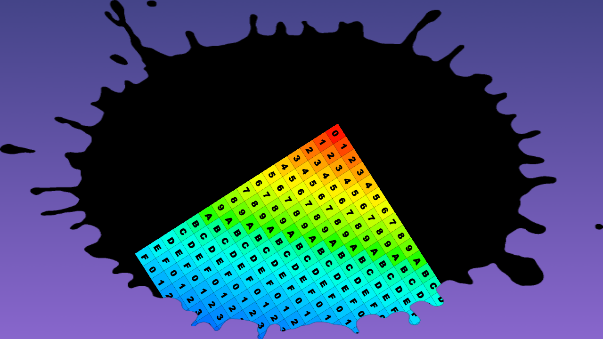

If we draw a game object mask, it is not transformed. Here, although the mask target is scaled and transformed, it still uses the current position of the mask object on the screen. (In this case, transforming the mask object _does_ make a difference!)

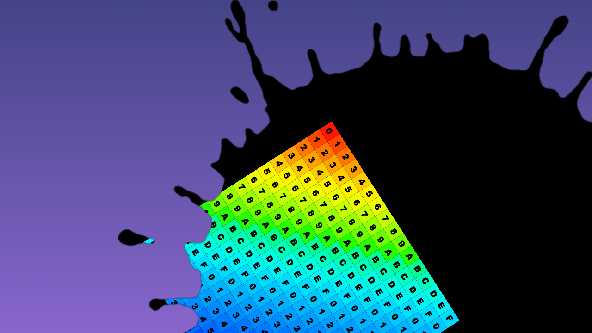

Note that some objects _must_ use external space for all their filters. (They still have an internal filters object; it just uses external coordinates.) This is because they don't have the information necessary to determine the size of the internal space. Sometimes this is because the object contains many smaller objects moving about unpredictably; sometimes it's because there's a complicated geometry around the edge.

## Conclusion

We've looked at the process of rendering a mask filter step by step. Hopefully, this illustrates what's going on, and shows you some common pitfalls to avoid when authoring your own masks. Nested transform coordinates can be complicated, so I like to just ignore them. Do your work in the 0-1 space, easy.
