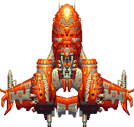
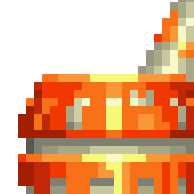
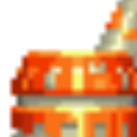
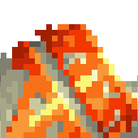
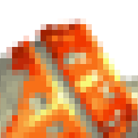
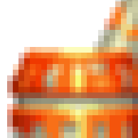
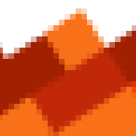
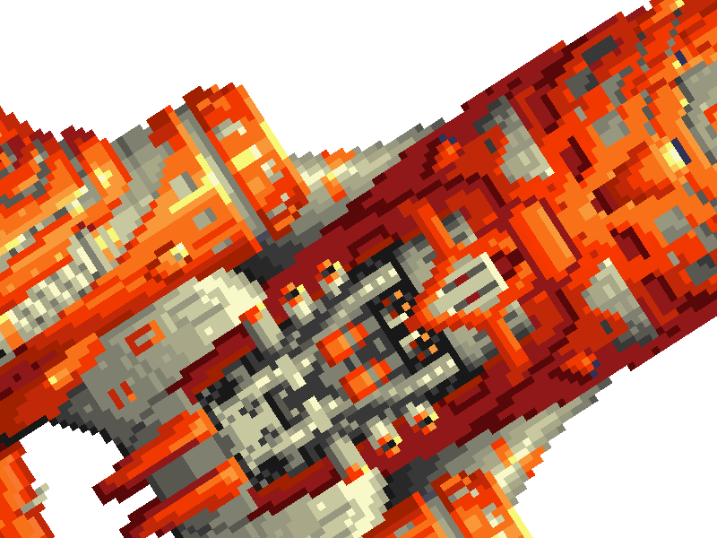
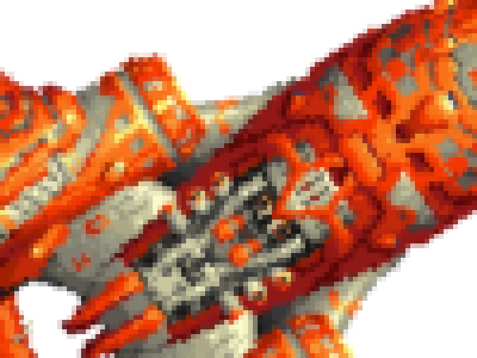
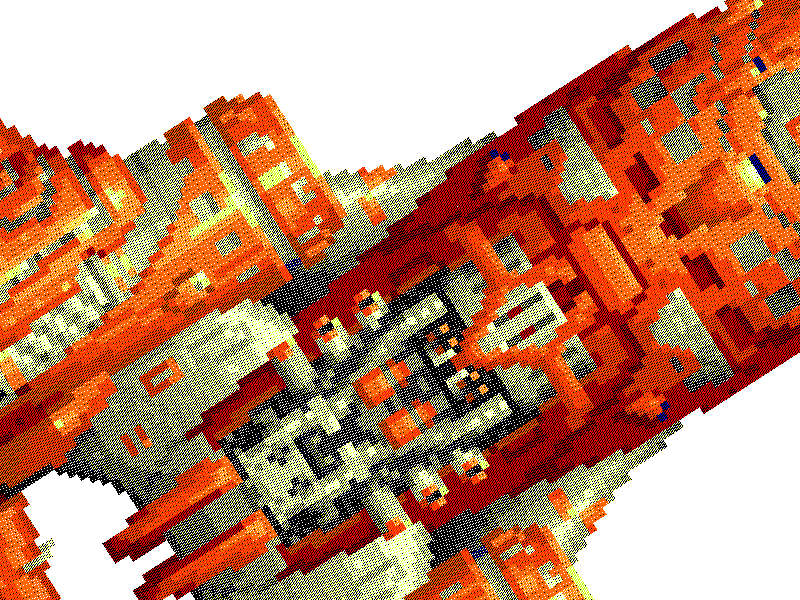

# Phaser 4 Pixel Art Guide

by Ben Richards

Pixel art began as a technical limitation, and has evolved into a full stylistic medium. Ironically, modern hardware has a difficult time rendering this simple style in a consistent way. This guide explains the basics of pixel art, why it can be challenging, and how to successfully work with pixels in Phaser 4.

## Cheat Sheet

- Do you want to scale and rotate game objects?
  - **Yes**: configure your game for smooth pixel art: `{ render: { smoothPixelArt: true } }`
  - **No**: configure your game for rounded pixel art: `{ render: { pixelArt: true } }`

Or in more detail:

- Do you want objects made out of big pixels?
  - Configure your game for smooth pixel art: `{ render: { smoothPixelArt: true } }`
  - Restrictions: you need to scale up your game objects.
- Do you want to display pixels 1:1 without blurring or distortion?
  - Configure your game for rounded pixel art: `{ render: { pixelArt: true } }`
  - Restrictions: you should avoid scaling, rotating, and zooming.
  - Antialiasing is automatically disabled.
- Do you want to simulate large display pixels?
  - Do you want to retain original color?
    - Configure your game to skip antialiasing: `{ render: { antialias: false, antialiasGL: false } }`
    - Apply a Blocky filter to the camera: `this.cameras.main.filters.external.addBlocky({ size: 8 });`
    - Optionally, add post-processing to further stylize the display.
    - Restrictions: you need to scale up your game objects, and use a fairly high resolution.
  - Do you want to blend color?
    - Apply a Pixelate filter to the camera: `this.cameras.main.filters.external.addBlocky(6);`
    - Optionally, add post-processing to further stylize the display.
    - Restrictions: you need to scale up your game objects, and use a fairly high resolution.

## What is Pixel Art?

Pixel art is an art style where individual pixels are used and distinguished.

A pixel is a "picture element", a component of a display surface. Modern liquid crystal displays (LCDs) have square pixels, but in the early days of computer gaming, output was commonly routed to television screens with non-square pixels. Cathode ray tube displays (CRTs) operated by sweeping a beam across lines on the screen, reducing the distinction between pixels. The result was smoothed out.

This was desirable at the time, because early gaming hardware had very strict rendering limitations. Memory was expensive, processors were slow, and output resolutions were tiny. For example, the original PlayStation could render at 320x240, even though it was intended for 720x480 televisions, because this was much faster than rendering every display pixel.

Early hardware also had very limited color options. Today, most displays show 24-bit color, 16777216 possible colors determined by mixtures of 256 possible values each of red, green, and blue. Early hardware, however, began with just _one_ color in monochrome displays. Later systems might support 16 colors, and at first those were the _same_ 16 colors all the time. For a while, hardware began to support _palettes_, or _indexed color_, where each color could be set to a very precise value. Palette based color supported techniques like _palette swapping_, where a sprite was assigned a new set of colors to produce a different entity; _palette animation_, where the palette itself was updated to cause an image to change without editing it; and even reprogramming colors as the render was underway, allowing hardware to render more colors per frame than it technically supported. 256 color palettes were enough for some very accomplished graphics.

Taken together, pixel art was basically a style where images were composed of coarse grids of limited colors. Each pixel was large and visible, and typically had a value from a limited palette.

Today, pixel art encompasses many approaches to these origins. All computer displays are still composed of pixels, but "pixel art" has come to indicate a style that embraces limitations in color and resolution. Pixel art disdains modern antialiasing: pixels should be crisp and cleanly separated. Blocky shapes are also common, going all the way to Minecraft's use of obvious cubes for everything.

Modern pixel art can be created in various ways, such as with programs like Aseprite. Here's an example I created a while back: the Thunderfrog, some kind of shoot-em-up vehicle. This image is 194x184 (positively massive by traditional pixel art standards), with a 28 color palette (much more reasonable). In the enlarged image, you can see how few colors are actually used to suggest light and form. Note that the enlarged version is a sort of trick! It's using multiple pixels per square. If you look close, you can see that I cut off some pixels halfway at the top right. That's impossible if we're talking about _real_ pixels, which are the smallest possible subdivision of the display.

 

> Can you make pixel art with AI? The answer is still evolving, but generally, no. Most models have trained on pixel art upscaled for modern displays, where one block of color occupies many true pixels. This typically teaches the image models the wrong lessons. They tend to prioritize axis-aligned edges and flat regions of color, but the edges never line up with a grid, and the colors never describe a limited palette. And getting transparency is often impossible. These models just aren't built for the assumptions of pixel art - if you do use them, you'll either have to find very specialized tools, or do a lot of retouching.

## Difficulties Rendering Pixel Art

Modern rendering hardware is much more powerful than the early, limited machines. Ironically, this makes it much harder to display your pixel art accurately.

### Display Density

A modern 4K display is 3840x2160 pixels (8294400 in total). That's over 100 times more pixels than the PlayStation in low res (320x240, 76800)!

A pixel art sprite might be just 64 pixels tall. You can stack 33 of them in a single column on a 4K display. They'll be only slightly taller than this line of text. That's very hard to see.

So you often need to inflate your sprites. However, this introduces further difficulties.

### Texture Filtering



Rendering hardware is built for 3D games portraying naturalistic worlds, and the crisp squares of raw pixels look very artificial. So GPUs provide **texture filtering**, which smoothly blends colors between pixels in a texture in `LINEAR` filtering mode.

Sometimes you still want filtering, even in 2D games. A game with high resolution assets built for a modern display will often look better with linear filtering. It emulates the smoothness of painted or drawn art, and eliminates the jagged "staircase" of pixels along the edge of a transparent sprite.

But when every pixel is important, you don't want to blend between them. You want them to stay crisp.

It might seem that filtering is only a problem when you inflate your pixels, but this is not true, as we'll soon see.

> Technically, an element in a texture is called a **texel**, but we'll call them pixels here.

### Antialiasing and Supersampling

 

"Aliasing" is a flaw in 3D graphics. When you render a diagonal line naively, you might move from pixel to pixel. There are no smaller display units, right? Why should you bother considering finer detail?

Well, look at the crisper detail above. With rotation, the flat edge of the housing has turned into a jagged "staircase". This is called **aliasing**, and it calls attention to the pixels. In 3D, that's undesirable. Even in 2D it doesn't look great - the "nearest pixel" filtering has created a bit of a mess.

GPUs provide **antialiasing** to eliminate this flaw. How this happens exactly can be very complicated, but we don't need to worry about it. Suffice to say, it usually involves **supersampling**: computing several fragments within a single pixel, then combining them into a single output color. You can see this in the smoother detail above.

Supersampling creates very smooth results. However, it has the same flaw as scaled-up texture filtering: it has to blend colors together. In this case it's even blended transparent pixels with filled pixels, creating partial transparency. Again, this ruins any crispness you might hope to achieve.

#### Sub-Pixel Positioning: A Common Mistake

When antialiasing is enabled, you will often run into a common problem: sub-pixel positioning.

When pixel art is aligned with the display pixels, each display pixel corresponds to a single texture pixel. You get the original, unblended colors, as intended.

But if the pixel art is _not_ aligned, the GPU will supersample to find the "correct" color for the display pixel, and your pixel art goes slightly blurry. This can even affect the legibility of text.

This can happen for various reasons.

- Physics can move sprites at fractional pixel rates, so their position is sub-pixel.
- If a sprite's size is odd (e.g. 63 pixels) and its origin is the default (0.5), it will be positioned with half-pixel accuracy (31.5 pixels).
  - You can fix this by setting origin to 0, but this will change positioning.
- Non-integer scale will produce non-integer pixel positions.
- Rotation that isn't based on quarter turns will supersample everything.

### Too Many Colors

Both texture filtering and supersampling create blended colors. These colors often aren't in the original image palette. If you're working with a restricted palette, this is not what you want!

Many visual effects, such as Bloom or additive blending, will also create blended colors. It's up to you whether you want to subject these effects to the same rules as any underlying pixel art; just note that it will be much more challenging.

### Pixel Flicker

Even if you use the rounding techniques described below, you may see pixel art flicker slightly. This is a consequence of rounding: it doesn't always round in the same direction, so values distort slightly.

For example, consider something scaled by a factor of 1.3. Texture pixels are spaced every 1.3 display pixels. The raw values might go 0, 1.3, 2.6, 3.9, 5.2. You can't round that into an even sequence! Rounding to the nearest integer goes 0, 1, 3, 4, 5: there's a big gap in the middle.

Worse, if you move the sprite over slightly, the gap could move to a different texture pixel. Just add 0.5 to each value, and it rounds to 1, 2, 3, 4, 6. Now the big gap is at the end! We only moved 0.5 pixels, but the gap shifted 2 pixels over. This flicker is easy to detect when using pixel art, as the crisp boundaries attract the human eye.

### Don't Worry about DLSS Yet

Modern GPUs provide features such as upscaling and frame generation to improve performance and power consumption. At the time of writing, these are not a concern for Phaser developers: there's no way to access them through the WebGL interface.

Even if they were accessible, it would be a bad idea to use them with pixel art. As noted above, neural net training struggles with pixel art techniques. The state-of-the-art in these technologies concentrates heavily on a specific visual style, based loosely on photo-realism. This is not necessarily the same thing as actual realism, because photography uses plenty of tricks to enhance visual intent. Even when shooting in broad daylight, all sorts of props like sun reflectors and black background nets are widespread. Pixel art is a very deliberate medium, so you could say that it's actually better than photo-realism, in terms of communicating ideas!

## Working with Pixel Art

We've seen what can go wrong. How can we fix it?

In this section, we'll look at all the options Phaser 4 provides to augment pixel art rendering, and then go over a few best practice approaches you should consider. Taken together, these should arm you for any kind of pixel rendering, even perhaps those that aren't pixel art at all!

### Options

Phaser 4 provides two main ways to support pixel art.

- Smooth Pixel Art (new in version 4): best for scaled-up pixels
- Rounded Pixel Art: best for preventing supersampling

These methods have different goals, and you should generally only pick one.

You can also use filters to help pixel art techniques.

#### Smooth Pixel Art

Smooth pixel art uses special shader code to render crisp pixels with antialiased edges.

When used with pixel art at its original scale, this doesn't provide any enhancement. Here's a magnified view of our sprite at a sub-pixel position; you can see that it was supersampled and became blurry.



However, when you scale up your art, you can see that the antialiasing is restricted to the edges of the pixels. The square pixels are overall preserved. (This image is a magnified version of a scaled-up game, just so you can see what the pixels are doing.)



Consider smooth pixel art if:

- You want to display large pixels.
- You want to remove aliasing.
- You want to eliminate pixel flicker.
- You don't mind small regions of blended color, but most color should be original.
- You don't want to bother with rounding logic.
- You want to maximize visual smoothness and use all the pixels available to you.

Smooth pixel art is available as a setting either for the full game, or for individual textures.

- Set global rendering in your game config: `{ render: { smoothPixelArt: true } }`
  - This automatically deactivates the config option `pixelArt`.
- Set individual textures with `texture.setSmoothPixelArt(true)`.
  - Caution: `smoothPixelArt` is a batch-wide setting. If the renderer finds objects with different `smoothPixelArt` settings, it must break the current render batch, which can slow down the frame rate if it happens too often. It's best to use the global setting.

> When a texture uses smooth pixel art, it actually sets `LINEAR` filtering. This allows it to get antialiased pixel edges. However, the shader concentrates on the middle of the texture pixel, eliminating the rest of the filtering.

#### Rounded Pixel Art

Rounded pixel art prevents blur from supersampling by forcing the renderer to fit things to the display pixel grid. This is useful for displaying pixel art at the original resolution, avoiding supersampling of individual pixels.

Consider rounded pixel art if:

- You want to display texture pixels at the same size as display pixels.
- You need to display text with maximum legibility.
- You won't use rotation, scaling, or camera zoom; or you don't mind aliasing.
- You don't mind a little pixel flicker.
- You don't want _any_ blended color.

There are several options for controlling rounded pixel art.

- Set global rendering in your game config: `{ render: { pixelArt: true } }`
  - This is actually a shortcut for setting `antialias` and `antialiasGL` to `false` (they default to `true`), and setting `roundPixels` to `true`.
- Set `roundPixels` in your game config: `{ render: { roundPixels: true } }`
  - Unlike `pixelArt`, this doesn't affect antialiasing. You might use it with `smoothPixelArt` sometimes.
- Set `camera.roundPixels` to `true`.
  - The `roundPixels` game config option sets the default value of `camera.roundPixels`.
- Set `gameObject.vertexRoundMode` to control rounding on a per-object basis.

Actual rounding is done at render time, based on the game object's `vertexRoundMode`, the object's transform, and the camera. A game object is considered "safe" if it is not scaled or rotated. A camera is considered "safe" if it is not zoomed and it has `roundPixels` enabled.

- `safeAuto` (**default**): Rounding is performed if the game object and camera are both safe.
- `safe`: Rounding is performed if only the game object is safe (ignores camera).
- `full`: Rounding is always applied.
- `fullAuto`: Rounding is applied if the camera is safe.
- `off`: Rounding is not applied.

Rounding snaps the vertices of the game object to integer values. This lines the object up with the display pixel grid, eliminating antialiasing. However, **this only works if there is no scale or rotation**. As noted under "Pixel Flicker", fractional coordinates round unpredictably, and can cause objects to flicker as they move. That's why the default is `safeAuto`: it only rounds when we can be confident that the pixels line up.

You can use `full` or `fullAuto` rounding to round more aggressively. This will cause flicker if you scale or rotate, but if you want to imitate older hardware, this could be what you need.

> Render-time rounding is not applied to object transforms. An object at a fractional position stays at that exact position. Phaser just adjusts the numbers as they're sent to the render system. This ensures that movement remains smooth and predictable - it's only visual appearance that snaps to the pixel grid.

##### Do Your Own Rounding

If you want to handle your own rounding, follow a few key rules.

- Set your game config to deactivate antialiasing: `{ render: { antialias: false, antialiasGL: false } }`.
- Don't scale, rotate, or zoom unless you know exactly what you're doing.
- Ensure that game object position and camera scroll are always integers.
- Check sprite size; if a dimension is odd, it risks blurring if you left antialiasing on.
- Avoid sub-pixel positioning by changing object origin from 0.5 to 0 (this moves the pivot from the middle to the top left corner).

#### Filters for Pixel Art

Phaser 4 also offers several filters for pixel art rendering. These can enhance existing approaches, or enable entirely new approaches.

- Blocky: make large pixels using original colors.
- Pixelate: make large pixels using blended colors.
- Quantize: reduce the number of colors in the image, and optionally dither.
- GradientMap: map colors to an indexed ramp by brightness.

Phaser 4 does not include "CRT filters" to simulate the appearance of pixel art on original hardware, because there's a lot of variety and you should find one you like. The existing filters will help you prepare imagery for a CRT filter.

It may seem like a mismatch to use other filters to stylize pixel art, but many games have successfully mixed this style with advanced lighting, bloom, etc. Go wild and see what happens.

##### Blocky Filter

The Blocky filter turns the image into a blocky grid of squares of solid color. This can simulate a low-resolution output device.

Blocky colors each square using the color at its middle. This preserves the original color of the filtered image. If you used a rendering technique which doesn't blend colors, this will preserve your intent.

Blocky works well when you follow these principles:

- Deactivate `antialias`/`antialiasGL`, so your colors are preserved.
- Set your game resolution high.
- Draw objects scaled up, so their pixels cover several display pixels.
- Apply Blocky to the camera, so you don't waste time filtering overlapping objects.
  - `this.cameras.main.filters.external.addBlocky({ size: 8 });`

This ensures that you are giving good information to Blocky. If you render with smaller pixels, you may see a lot of flicker, as the filter samples different colors when objects move.

For example, here's an object drawn without Blocky, using large pixels and no antialiasing.



And here's the same object drawn with Blocky. Note how the pixel grid now conforms to the screen orientation. If you compare image histograms, they are identical: no new colors were introduced by Blocky (although some might be lost).


##### Pixelate Filter

The Pixelate filter works much like Blocky, and is likewise suited to simulating low-resolution output. The only difference is that it _blends_ color: its output color is 40% the center of the square, and 15% from each corner of the square. The result is not guaranteed to be an original color from your pixel art, but it may appear smoother.

`this.cameras.main.filters.external.addPixelate(6);`



##### Quantize Filter

The Quantize filter reduces color count in your image, and optionally applies dithering to improve image quality.

Quantize doesn't enhance the precision of your pixel art; it just adjusts the colors. This is useful for emulating the look of old, limited-color hardware. It does not emulate any specific hardware palette; it just breaks channels down into a limited number of steps.

Because Quantize doesn't have any way to apply an indexed color palette, it cannot match the simplicity of a sprite actually authored with limited colors. This technique might be better used for adjusting the full screen output after other effects are applied, to conform colors to a quantized space.

Quantize can dither its output. This uses Interleaved Gradient Noise to smooth out color transitions, making the image look like it has many more colors than it really does. Dither is an entire other art style. Although it looks cool, it is generally used when preparing assets, not at runtime.

A sample config is as follows:

```js
this.cameras.main.filters.external.addQuantize({
    mode: 1, // HSVA mode, allowing better control over hue
    steps: [ 16, 2, 2, 2 ], // 16 colors, 2 levels of brightness and saturation, 2 levels of alpha
    dither: true
});
```

The result looks like this. Note how the dither has to mix pixels of different colors to approximate the original input. This would be fragile if any further filtering were applied.



##### GradientMap Filter

The GradientMap filter uses a `ColorRamp` definition to remap an image by its brightness. Because `ColorRamp` supports very large numbers of bands, and a band can simply start and end at the same color, you can use it to set different brightness areas to any colors you want. This is a way to apply palette swapping at runtime.

Creating the ramp definitions and a value-keyed source sprite can be laborious, however. Consider the following alternatives:

- Create palette-swapped variants as ordinary textures.
- Create textures out of layers, where each layer can be adjusted with `ColorMatrix` or other filters individually; then combine them in a `DynamicTexture`.

Nevertheless, GradientMap may be just what you need if you want to create palette cycling animations or some other specific effect.

### Best Practice

What should you do to get the best out of your pixel art in a game?

The answer depends on a great many factors, but we can boil it down to just a few categories:

- Do you want objects made out of big pixels?
  - Configure your game for smooth pixel art: `{ render: { smoothPixelArt: true } }`
  - Restrictions: you need to scale up your game objects.
- Do you want to display pixels 1:1 without blurring or distortion?
  - Configure your game for rounded pixel art: `{ render: { pixelArt: true } }`
  - Restrictions: you should avoid scaling, rotating, and zooming.
  - Antialiasing is automatically disabled.
- Do you want to simulate large display pixels?
  - Do you want to retain original color?
    - Configure your game to skip antialiasing: `{ render: { antialias: false, antialiasGL: false } }`
    - Apply a Blocky filter to the camera: `this.cameras.main.filters.external.addBlocky({ size: 8 });`
    - Optionally, add post-processing to further stylize the display.
    - Restrictions: you need to scale up your game objects, and use a fairly high resolution.
  - Do you want to blend color?
    - Apply a Pixelate filter to the camera: `this.cameras.main.filters.external.addBlocky(6);`
    - Optionally, add post-processing to further stylize the display.
    - Restrictions: you need to scale up your game objects, and use a fairly high resolution.

In general, don't mix rounded pixel art with smooth pixel art. However, filters mix well with any technique.

An even simpler question:

- Do you want to scale and rotate game objects?
  - **Yes**: configure your game for smooth pixel art: `{ render: { smoothPixelArt: true } }`
  - **No**: configure your game for rounded pixel art: `{ render: { pixelArt: true } }`

> Text rendering is also affected by pixel art options. If you are displaying text in your game, you should take care to make it maximally legible. This is easy: keep the Text game object origin at 0, and keep its position at integer values. With the `roundPixels` option active, this will happen automatically; otherwise, you need to be a bit more careful. Sometimes you simply can't, such as when text is moving or otherwise transforming - but it should always come to rest in the most legible way.

## Conclusion

Pixel art is a fun, expressive medium, but it can be a pain to render sometimes. This guide has detailed the following approaches:

Use big pixels with antialiased edges using `smoothPixelArt`.

Eliminate blurring from sub-pixel positioning using `pixelArt` or `roundPixels`.

Pixelate your game using `Blocky` or `Pixelate`.

In addition, you now have reference to many ways pixel art can go wrong, giving you the tools to understand and resolve rendering problems.

We hope you have a great time with pixel art. It's the foundational style upon which 2D game development is based.
