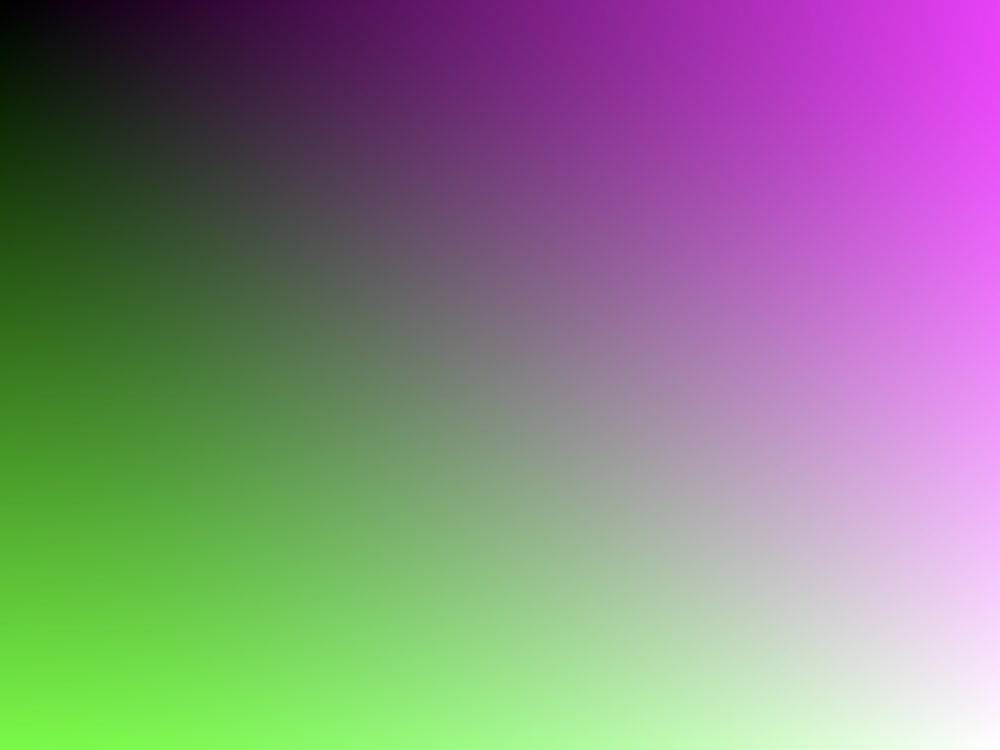
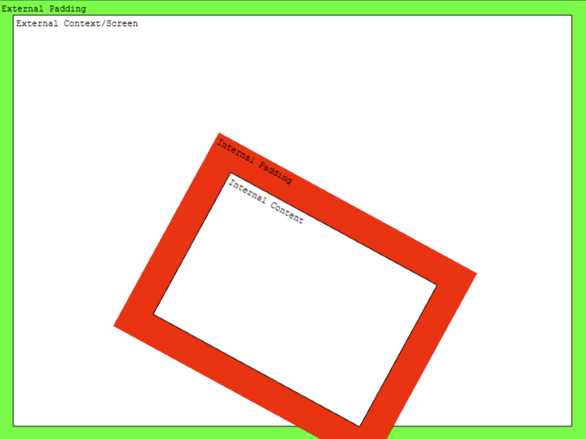

# Phaser 4 Shader Guide

Phaser 4 updates the WebGL rendering system to become more powerful and reliable than ever before. This guide explains the core concepts, and how to use shaders in the new system.

1. Rendering Concepts
2. Sample Shader GameObject, Step By Step
3. Sample Filter, Step By Step
4. Built In Shaders and Shader Additions

## 1. Rendering Concepts

The Phaser 4 WebGL renderer is a complete rewrite from Phaser 3. It concentrates on encapsulated drawing, where rendering operations will work anywhere in the system.

The following concepts are relevant:

- WebGL State Management
- DrawingContext Objects
- Batched Rendering
- Render Nodes
- Unified Draw Commands

### WebGL State Management

Phaser 4 completely abstracts WebGL calls. You should never need to access the `gl` object.

If you somehow need to access the internal WebGL state, never call `gl.someFunction()`. Instead, use the Phaser wrappers, including:

- `Phaser.Renderer.WebGL.Wrappers.WebGLGlobalWrapper`, instantiated at `game.renderer.glWrapper`. This object is a mirror of GL state, such as blend mode, current texture/shader/framebuffer bindings, scissor, texture premultiplication, etc.
- `WebGLShaderSetterWrapper`, instantiated at `game.renderer.shaderSetters`. This object stores references to GL constants, data sizes, and shader uniform setter methods for internal use.
- `WebGLTextureUnitsWrapper`, instantiated at `game.renderer.glTextureUnits`, manages texture unit allocation. This binds textures to texture units, allowing them to be accessed by shaders. This is handled automatically by the renderer.
- Resource wrappers, such as `Phaser.Renderer.WebGL.Wrappers.WebGLTextureWrapper`. These objects are created to contain WebGL resources such as a `WebGLTexture`, along with information about their creation. These should be created using methods such as `game.renderer.createTextureFromSource` rather than the `new` constructor.
  - `WebGLBufferWrapper` manages a data buffer, used by vertex shaders. There are two kinds, index and vertex. Index buffers store a sequence of vertices, allowing vertex reuse for greater efficiency; they are created by `game.renderer.createIndexBuffer()`. Vertex buffers store actual data about the vertex, such as position, tint, and texture coordinates; they are created by `game.renderer.createVertexBuffer()`.
  - `WebGLFrameBufferWrapper` manages a framebuffer, a texture that acts as a render target. Framebuffers are created as part of DrawingContext objects (see below).
  - `WebGLProgramWrapper` manages a shader program, the compiled combination of a vertex shader and a fragment shader. Shader programs are managed by ProgramManager instances within render nodes; a ProgramManager may hold several wrappers, each containing a variant program.
  - `WebGLTextureWrapper` manages a texture. Texture wrappers are created automatically with Texture objects. You can create them using `game.renderer.createTextureFromSource()`.
  - `WebGLVAOWrapper` manages a Vertex Array Object (VAO), which remembers the attribute layout for a vertex buffer so we don't have to constantly re-apply settings. These are created automatically by ProgramManager instances.
  - `WebGLVertexBufferLayoutWrapper` manages a vertex buffer wrapper and the data types stored within it. This is actually created as `new WebGLVertexBufferLayoutWrapper(...)`. It is used by render nodes which compose vertex buffers for rendering.

These wrappers let us track the state between functions, and recreate it if the WebGL rendering context is lost.

> **DynamicTexture and Lost Context**
>
> The DynamicTexture (which is used by RenderTexture objects) draws to a texture in WebGL. These textures will be blank after the WebGL rendering context is recovered. All other textures and resources should be recreated completely.

If you alter the WebGL state outside these systems, the state may become unstable. Please use the built-in management systems if you need to make direct GL calls.

### DrawingContext Objects

The DrawingContext is an internal renderer feature which helps encapsulate drawing operations. It's only relevant if you're working with the renderer internals.

The `Phaser.Renderer.WebGL.DrawingContext` object is a localised WebGL state which describes the current drawing settings. These include the camera, blend modes, framebuffer, and other settings which affect how and where pixels get drawn. It is like a drawing desk set up in a specific way.

DrawingContext is _nestable_: you can create a new DrawingContext, use it for drawing some objects, and then throw it away, returning to the previous DrawingContext. Use `drawingContext.getClone()` to create a copy, then modify it in place.

When handling a DrawingContext, you must call `drawingContext.use()` and `drawingContext.release()` at the start and end of its use. These run necessary code, such as clearing the context if it is scheduled for reuse, and starting new batch renders. Because a fresh DrawingContext has different drawing rules, it must notify existing batch renders that they should finish up before it goes into effect.

A DrawingContext can hold a framebuffer, in which case `drawingContext.texture` will refer to a texture. Everything drawn using the DrawingContext is drawn to this texture. For persistent resources like DynamicTexture, the texture is permanently retained. For temporary resources such as Filters, it will be cleared before its next use.

### Batched Rendering

Batching is handled automatically, but it is useful to understand it to ensure your games perform well.

The most basic way of drawing is a "Stand Alone Render" (SAR). This makes one draw call per object. Unfortunately, draw calls are quite expensive. The cost varies by device and content, but typically you shouldn't exceed a few hundred draw calls per frame.

Phaser automatically batches common objects which can be combined into a single draw call. Most objects are "quads", which use the same shader and set of textures, so they batch together. This is far more efficient, and you should try to have large batches wherever possible for good performance.

Batches will "flush", rendering their contents and starting a new batch, when they meet one of several conditions:

- The batch is full (16384 quads).
- You run out of texture units.
  - Most devices provide 8 or 16 texture units, so you can use that many textures in a single batch.
  - Mobile devices may support many texture units, but perform best when using just 1. Set the game config option `autoMobileTextures` to tell Phaser to drop to 1 TU if it detects a mobile device.
- You use a different shader program.
  - You use a different type of game object. Many game objects share shaders. Significant groups include:
    - Basic quads: Image, Sprite, Text, BitmapText, etc.
    - Repeating quads: TilemapLayer, Tilesprite, etc.
    - Vector objects: Graphics, Shapes, etc.
    - Stand Alone Render objects: TilemapGPULayer, Rope, etc.
  - You use Filters, which not only use different shaders, but switch DrawingContext.
  - You use the same game object, but in a way that requires changes to the shader program.
    - You have one object which uses lights, and another which does not.
    - You have enabled `roundPixels`, such as via the `smoothPixelArt` config option, and one object is at default scale and rotation while another is scaled or rotated.

There may be other things that trigger batch flushes, and it may behave differently on different devices. In general, try to keep similar game objects next to each other in the display list, use texture atlases instead of single textures, and your scene will behave better.

### Render Nodes

A RenderNode is an object which handles some task in the render system. This is relevant only if you're working with render system interiors.

RenderNodes should be registered to the `Phaser.Renderer.WebGL.RenderNodes.RenderNodeManager` at `game.renderer.renderNodes`. Use `addNode()` to add an instantiated node. Use `addNodeConstructor()` to add a constructor which will be instantiated when requested. Use `getNode()` to request a node from the manager.

A node can have state, but be aware that the node will be reused, so if it might cause further rendering, consider using new objects to hold state.

A node doesn't have any fixed functionality. By convention, it does one job, which is invoked with `node.run()`. You should call `this.onRunBegin()` and `this.onRunEnd()` at the start and end of `run`; these methods let you debug nodes.

A node which provides batch functionality is invoked with `node.batch()` instead. You should call `this.manager.setCurrentBatchNode(this, drawingContext)` to signal that a batch is running. The render node manager will flush the batch by calling `run(drawingContext)` if another render node signals that it is changing the render state. You can also call `run` yourself from the batch method if you detect that the batch is complete. Here, the `run` method should immediately render the batch.

Nodes can call other nodes. This network forms the "render tree". You can see the render tree by running `game.renderer.renderNodes.setDebug(true)` to capture a frame, then `game.renderer.renderNodes.debugToString()` to get a formatted string describing which render nodes ran in your game.

> The idea of Render Nodes is to allow a flexible approach to rendering tasks. For performance reasons, the default nodes do a small number of large jobs. However, it's quite possible to break this down into a larger number of smaller, more customizable jobs.

### Unified Draw Commands

Phaser 4 uses a unified set of commands to draw with WebGL. These are relevant only if you are working with renderer internals.

The `game.renderer.drawElements()` method is used for all current drawing operations in Phaser 4. We also surface `game.renderer.drawInstancedArrays()` if this functionality is required. Both methods behave the same way.

WebGL state is only updated when a draw command is called. This prevents redundant or unnecessary calls from taking effect. You can update state manually in other circumstances, but this should rarely be necessary.

## 2. Sample Shader GameObject, Step By Step

The `Shader` GameObject uses your custom shaders to draw a quad. It's similar to a Sprite, except instead of a texture, it renders whatever you want to the area covered by the object.

To master using Shader, consider the following areas.

- Shader Rendering
- Authoring Shaders For Phaser
- Loading Shaders in your Game
- Creating Shader Objects

> Shaders and shader programs: the Shader game object can be confused with a shader program, the compiled vertex and fragment shaders that render everything in WebGL. To avoid confusion, we always capitalize Shader when it refers to a game object, and leave it lowercase when it refers to a shader program.

### Shader Rendering

A Shader is a Stand Alone Render quad. This means that it interrupts any current batch, and does not batch itself. Each Shader uses a draw call, so be sparing with their use.

### Authoring Shaders For Phaser

Shaders support custom vertex and fragment shaders. However, the default vertex shader works fine, so you should only think about the fragment shader.

Consider the following areas:

- Varyings
- Additions

#### Varyings

The default vertex shader provides one input to the fragment shader: `varying vec2 outTexCoord`. This provides coordinates from 0-1 in X and Y, telling the fragment shader which part of the quad it's in.

Note that Phaser 4 uses texture conventions where 0x0 is in the bottom-left of the texture. WebGL generally treats 0x0 as the bottom-left too, but other programs and shaders might not, so be aware of this convention. This shouldn't make a difference, as Phaser 4 treats vertex coordinates as top-down.

#### Additions

If your shader does one thing, a single file works fine. But if you want to configure it at runtime, you should consider the Phaser 4 shader addition system.

By using templating, you can split your GLSL code into multiple files, then combine them in various ways.

Shader templating uses GLSL preprocessor commands to define insertion points in the code. This templating system allows you to write valid GLSL code, so your editor/IDE can give as much assistance as possible.

Use `#pragma phaserTemplate(key)` to define an insertion point in your code. These points are replaced with all additions using that key, in the order they are defined, or with nothing if no additions use the key.

The template key `#pragma phaserTemplate(shaderName)` will define `SHADER_NAME` to the shader name used in the game. This can be useful for debugging, but is not necessary.

You can also define conditional code. Use `#define KEY` to define KEY, then use `#ifdef KEY` or `ifndef KEY`, `#else`, and `#endif` to check the state of a define. This is most useful when the define is added in an addition.

A simple example:

```glsl
#pragma phaserTemplate(enableBigNumber)

float getNumber ()
{
    #ifdef BIG_NUMBER
    return 10;
    #else
    return 2;
}
```

By default, this will return `2`. If you use a shader addition which adds `#define BIG_NUMBER` to `enableBigNumber`, the shader will instead return `10`.

Other uses for additions:

- Add optional code.
- Reuse code across many shaders, to reduce the size of your game package, or help you manage a large codebase.

### Loading Shaders in your Game

Once you have written your shaders, you need to get them into your game. You can treat shader code in two ways:

- Load GLSL files
- Inline strings

These both have the same capabilities, and can be combined together. They're just accessed differently.

#### Load GLSL files

A GLSL file is a single shader or snippet of GLSL code.

Load a file like this:

```js
class Example extends Phaser.Scene
{
    preload ()
    {
        this.load.glsl('Marble', 'assets/shaders/marble.frag');
    }
}
```

This will add the specified file to the game's shader cache under the key `Marble`. You can use the key in later steps. You can retrieve the file data using `game.cache.shader.get('Marble')`. It is stored as a `Phaser.Display.BaseShader`. The property `baseShader.glsl` contains the code from the file.

> In Phaser 3, there were "shader bundles" which contained several shaders along with metadata. In Phaser 4, this is no longer valid; bundles will not be parsed into separate shaders.
>
> If you want to load large amounts of shader code, use JSON, XML, or other supported formats.
>
> Phaser 3 also categorized shaders as either vertex or fragment, and combined them together as they loaded. Because Phaser 4 supports snippets that can be combined in many ways, this is no longer practical. A GLSL file is simply a single text file.

#### Inline Strings

You can define shaders or shader snippets as strings in your code. This is useful for keeping the number of files down, but may also prevent you from checking syntax in your GLSL code.

### Creating Shader Objects

Once your shader is written and loaded, you can create it in your game. This uses the `Phaser.GameObjects.Shader` object.

The object has the following parameters:

```js
// `this` is a Scene.
this.add.shader(config, x, y, width, height, textures)
```

- `config` is the main options object, and will be explained below.
- `x`, `y` are position.
- `width`, `height` are dimensions of the shader quad.
- `textures` is a list of textures or texture keys for the Shader to use, as explained below.

#### Config Object

The Shader config object has the following shape:

```ts
type ShaderQuadConfig =
{
    // Required:
    name: string;

    // Following are optional:
    shaderName: string;
    fragmentSource: string;
    vertexSource: string;
    fragmentKey: string;
    vertexKey: string;
    initialUniforms: { [string]: number | number[] | TypedArray | boolean | boolean[] };
    setupUniforms: (
        setUniform: (name: string, value: any) => void,
        drawingContext: Phaser.Renderer.WebGL.DrawingContext
    ) => void;
    shaderAdditions: Phaser.Types.Renderer.WebGL.ShaderAdditionConfig[];
    updateShaderConfig: (
        drawingContext: Phaser.Renderer.WebGL.DrawingContext,
        gameObject: Phaser.GameObjects.Shader,
        renderNode: Phaser.Renderer.WebGL.RenderNodes.ShaderQuad
    ) => void;
}
```

A typical config can be very simple:

```ts
// When using a loaded GLSL file:
const config1 = {
    name: 'myShader',
    fragmentKey: 'Marble'
};

// Or when using inline GLSL code:
const glsl = '// GLSL code goes here';
const config2 = {
    name: 'myOtherShader',
    fragmentSource: glsl
};
```

A more complete explanation follows:

`name`: Required. The overall name of your Shader. Your Shader creates a `Phaser.Renderer.WebGL.RenderNodes.ShaderQuad` with this name. Because the node is only stored in the Shader, this name doesn't need to be unique. It helps with debug.

`shaderName`: The name used as the base of the shader program name. If not given, defaults to the `name` property. If your shader code contains `#pragma phaserTemplate(shaderName)`, the name will be inserted there, including this base, any enabled shader additions, and whether it is a vertex or fragment shader. This helps with debug.

`fragmentSource` and `vertexSource`: The source code of the fragment and vertex shaders, as inline strings. Both of these have default options. The default `vertexSource` enables default behavior and should not need to be set. The default `fragmentSource` displays a color gradient to show that the shader is working (see below).

`fragmentKey` and `vertexKey`: The key of the fragment and vertex shaders in the game cache. The `fragmentSource` and `vertexSource` properties will override these options, if present.



`initialUniforms`: A list of uniforms to set, once, when the shader program is created. You should assign textures to units here if you do not expect to swap textures after creation.

```ts
// How to set textures on a Shader:
const config = {
    initialUniforms: {
        uTexture: 0,
        uSecondaryTexture: 1,
        uThirdTexture: 2
    }
};
```

`setupUniforms`: A function for setting shader program uniforms. It is assigned to the Shader's render node, and runs every time the Shader is rendered. It is invoked with `setUniform()` and `drawingContext`. The `setUniform(name, value)` method is passed in by the render node, and can be called to set uniforms in your shader. This is useful for animating values, and is also necessary for changing textures. The `drawingContext` contains information about the current GL state.

```ts
// How to update the `time` uniform on a Shader:
const config = {
    setupUniforms: (setUniform, drawingContext) =>
    {
        setUniform('time', this.game.loop.getDuration());
    }
};
```

`shaderAdditions`: A list of shader additions. Different additions may add to the same template location, so order is important. Each addition is an object describing what to add to the shader code. It is of the shape:

```ts
type Phaser.Types.Renderer.WebGL.ShaderAdditionConfig =
{
    // The name of this addition. This contributes to the full shader program key.
    name: string;

    // A list of additions to make. The `key` is located in the shader by `#pragma phaserTemplate(key)`. The value is added to that location in the shader, as well as values from other additions.
    additions: { key: string, value: string }[];

    // Optional tags used to identify the addition if the name changes.
    tags: string[] | undefined;

    // Whether to disable the addition. A disabled addition is not compiled into the shader program.
    disable: boolean | undefined;
};
```

An example addition, designed to add texture mapping to the default fragment shader (`ShaderQuad.frag` in the Phaser source code):

```ts
const addition = {
    name: 'myAddition',
    additions: [
        { key: 'fragmentHeader', value: 'uniform sampler2D iChannel0;' },
        { key: 'fragmentProcess', value: 'fragColor = texture2D(iChannel0, outTexCoord);' }
    ]
};
```

`updateShaderConfig`: A function which reconfigures the shader program. This is an advanced feature used to manage shader additions. This can be useful if you change a game setting and need to recompile your shader. It is assigned to the Shader's render node. The function is called during rendering, before `setupUniforms`. The function is probably an arrow function, so even though it belongs to the render node its `this` may not match, so we pass in the render node as a parameter for convenience.

```ts
// How to toggle a shader addition on a Shader:
const config = {
    updateShaderConfig: (gameObject, drawingContext, renderNode) =>
    {
        // Manages the shader program and cached variants.
        const programManager = renderNode.programManager;

        // How to get an existing addition:
        const myAddition = programManager.getAddition('myAddition');

        // Toggle addition:
        myAddition.disable = !myAddition.disable;

        // The shader will recompile additions once this function returns.
    }
};
```

As well as enabling or disabling additions, you can edit their code directly.

However, Phaser 4 caches shaders by name, to avoid expensive shader compilation. It will only compile your changes if you change the name of the addition. For example, the core shader which handles sprite rendering has an addition which changes its name based on how many textures each batch should contain; it might be `1TexCount` or `8TexCount`.

To facilitate the fact that their names can change, additions can have tags.

```ts
// How to successfully edit a shader addition on a Shader:
const config = {
    updateShaderConfig: (gameObject, drawingContext, renderNode) =>
    {
        const programManager = renderNode.programManager;

        // How to get an addition when you don't know its name:
        // (it's up to you to handle the case where multiple additions share a tag)
        const myAddition = programManager.getAdditionsByTag('ITERATOR')[0];

        // Edit the tag:
        const iterations = gameObject.iterations;
        myAddition.name = 'ITERATIONS_' + iterations; // Trigger recompilation.
        myAddition.fragmentHeader = '#define ITERATION_COUNT ' + iterations;
        // Note: this edit has a SPACE before the variable.
        // Note 2: GLSL will interpret this as an `int`, not a `float`,
        // unless you add a trailing '.0' or '.'.
        //
        // We use a similar pattern to change the length of `for` loops internally,
        // because GLSL does not support variable loop length after compile time.
    }
};
```

#### Textures in Shaders

If you have textures in your shader, you must supply them during construction, and set them as uniforms. Here is a game which demonstrates a minimal textured shader.

```ts
class Example extends Phaser.Scene
{
    preload ()
    {
        this.load.image('checker', 'assets/pics/checker.png');
    }

    create ()
    {
        const frag = `
        precision mediump float;
        uniform sampler2D iChannel0;
        varying vec2 outTexCoord;

        void main ()
        {
            vec4 pixel = texture2D(iChannel0, outTexCoord);
            gl_FragColor = vec4(outTexCoord.xyx * pixel.rgb, 1.0);
        }
        `;

        const shader = this.add.shader({
            name: 'simpleTexture',
            fragmentSource: frag,
            initialUniforms: {
                iChannel0: 0
            }
        }, 400, 300, 800, 600, [ 'checker' ]);
    }
}

const game = new Phaser.Game({
    type: Phaser.WEBGL,
    width: 800,
    height: 600,
    scene: Example
});
```

Note that the Shader object is constructed with an `initialUniforms` object which sets the texture uniform, and a list of textures `[ 'checker' ]`. Because the texture is at index 0 in this list, it will be assigned to texture unit 0, so we set the uniform for the texture to 0. Other textures would be in unit 1, then 2, 3 etc. If you do not set the uniform for a texture, it will be 0; this may still work if you are using a single texture, but it is not usually what you want.

When using textures, you may find it useful to adjust the texture coordinates using `shader.setTextureCoordinates()` or `shader.setTextureCoordinatesFromFrame()` if you are using a frame from a texture atlas.

## 3. Sample Filter, Step By Step

Filters are an alternative way to use shader programs. Where a Shader just has an output, a Filter has an input and an output, and is designed to operate as part of a stack of other filters, progressively altering imagery as it passes through the stack.

Filters are available on cameras and all game objects. Consider the following areas:

- Using Filters
- Authoring Filters

### Using Filters

Filters are available on cameras by default at `camera.filters`. To use filters on game objects, run `gameObject.enableFilters()`, then access `gameObject.filters`.

Filters are divided into two lists: `filters.internal` and `filters.external`. Internal filters try to follow the camera or object. External filters run after the internal filters, and sit "outside" or "after" the camera or object - they usually affect the whole screen.

Create a Filter in a list with an add method, e.g. `const filterController = gameObject.filters.internal.addBlur()`. Filters usually have several configuration parameters, which can be modified from the controller object later on.

Each filter can set padding using `filterController.setPaddingOverride()`. Pass four numbers to set the left, top, right, and bottom padding values. Pass just `null` to set automatic padding for those Filters that support it.

Here's a simple diagram of padding and the internal/external context.



The external context is _usually_ the screen, but if you are rendering objects inside other objects, the external context might be the internal context of another filter.

If you put internal filters on something without width and height values, the internal context is the same as the external filters.

On a technical level, each filter draws to a fresh framebuffer, which is passed as a texture input to the next filter. This is handled by a pool of DrawingContext objects maintained by the renderer.

### Authoring Filters

Filters are slightly more complex than Shaders, but they use the same core shader program systems. Most of the same concepts apply to authoring.

To create a Filter with a custom shader program, you need two parts: a Controller and a RenderNode. Here's an example:

```ts
class BumpToNormal extends Phaser.Filters.Controller
{
    constructor (camera)
    {
        // The name 'FilterBumpToNormal' is defined in FilterBumpToNormal.
        super(camera, 'FilterBumpToNormal');

        // Properties on the controller are used to pass data to the shader.
        this.radius = 1;
    }
}

const fragmentShaderBumpToNormal = `// GLSL code goes here`;

const additions = {}; // You would define any additions here.

class FilterBumpToNormal extends Phaser.Renderer.WebGL.RenderNodes.BaseFilterShader
{
    constructor (manager)
    {
        // The name 'FilterBumpToNormal' is used by the Controller.
        super('FilterBumpToNormal', manager, null, fragmentShaderBumpToNormal, additions);
    }

    // This function is called by the renderer.
    setupTextures (controller, textures, drawingContext)
    {
      // Custom code goes here.
      // `textures` is an array of WebGLTextureWrapper objects.
      // These will be assigned to texture units in list order.
      // `textures[0]` is always the input from the previous step in the filter stack.
      // Assign your textures to `textures[1]` and up.
    }

    // This function is called by the renderer after `setupTextures`.
    updateShaderConfig (controller, drawingContext)
    {
        // Custom code goes here.
        // This works just like a Shader: update your shader additions here.
        const programManager = this.programManager;
    }

    // This method sets up the uniforms for the shader.
    // It is called by the renderer after `updateShaderConfig`.
    setupUniforms (controller, drawingContext)
    {
        // Custom code goes here.
        // This works much like a Shader, except because you're defining a whole class,
        // you have access to `this.programManager` directly.
        const programManager = this.programManager;

        programManager.setUniform('resolution', [ drawingContext.width, drawingContext.height ]);
        programManager.setUniform('radius', controller.radius);
    }
}
```

Note that a Filter only takes a fragment shader; there is no option for a vertex shader. This is because the vertexes are calculated by Phaser as it composites the filter stack.

Note also that the BaseFilterShader extension uses inline GLSL code for this example. It also supports loaded GLSL files, just like Shader; use `super('FilterBumpToNormal', manager, key)` where `key` replaces `null` to use a cache key.

To use your filter, you must first register the render node, and then add it to a game object.

```ts
class Example extends Phaser.Scene
{
    preload ()
    {
        this.load.image('distortion8', 'assets/textures/distortion8.png');
    }

    create ()
    {
        if (!this.renderer.renderNodes.hasNode('FilterBumpToNormal'))
        {
            // Load the custom filter.
            // We load during scene creation because the renderer has booted by this point.
            this.renderer.renderNodes.addNodeConstructor('FilterBumpToNormal', FilterBumpToNormal);
        }

        // Add an image for filtering.
        const image = this.add.image(640, 360, 'distortion8')
        .enableFilters();

        // Add custom filter to the image.
        // Note that the filter requires a camera to be passed to it.
        const bumpToNormal = image.filters.internal.add(
            new BumpToNormal(image.filterCamera)
        );
        bumpToNormal.radius = 8;
    }
}
```

This is a simple example. You can use all the more advanced features of Shaders with Filters, including shader additions which you can manage in `updateShaderConfig`. To create a Filter with shader additions, just add them to the `BaseFilterShader` call:

```ts
super(name, manager, fragmentShaderKey, fragmentShaderSource, shaderAdditions);
```

## 4. Built In Shaders and Shader Additions

All of the shaders and shader additions used in Phaser 4 have their code available through the library. Here we'll discuss how you can use them to your advantage, or as inspiration for further development.

### Shader Additions Redux

Phaser 4 uses a templating system called Additions to create variants of a shader.

To support Additions, a shader must set template points. These are simply a line of the form `#pragma phaserTemplate(KEY)`. This defines the point where Additions add code associated with `KEY`. This is valid GLSL preprocessor code, so it works in code editors, and is replaced before the shader compiles.

An Addition is a config object with the following properties:

- `name`: A unique identifier.
  - Example: `'ITERATIONS_1'`
  - The name may have a numeric qualifier, to distinguish between variants of the Addition. Additions with the same name are assumed to be identical, even if the shader code has changed.
- `tags`: Optional array of tags.
  - Example: `'ITERATION'`
  - These can help categorize Additions, but they also provide a way to access Additions if their name changes.
- `disable`: Optional flag.
  - Disable an Addition to temporarily remove its code from the shader. Its name is automatically removed from the shader while disabled.
- `additions`: Object with key-value pairs describing template points and GLSL code.
  - Example: `{ fragmentHeader: someCode }`
  - The key is the key from a `phaserTemplate` pragma.
  - The code is added to the shader. Several Additions can use the same key simultaneously. They are added in order of Addition.
  - Keys are added to both vertex and fragment shaders.
  - If the key doesn't exist, no code is added.
  - Additions can define further `phaserTemplate` keys. Be cautious: these can only be found by Additions that come after them.

### Structure of Extensible Shaders

Many shaders in Phaser 4 have template points for Additions. Many are specialized, but a few are universal or intended for widespread use. The most common shaders to extend are likely for a Filter or a Shader game object, but we'll also look at the Multi shader which is used for common sprite operations.

Template points will be identified by the `KEY` in `#pragma phaserTemplate(KEY)`.

#### Universal Template Points

- `shaderName`: The shader name will be defined here. This serves no purpose except in debug. Include it so you have it when you need it most.

#### Shader Game Object Template Points

The default fragment shader has a wide set of template points, so you can create your own modular shader code. You may choose to supply your own fragment shader, which won't have any points unless you add them.

- `extensions`: Enable optional WebGL features. These must also be enabled in `game.renderer`.
  - Extensions must be enabled before any other GLSL code.
  - Phaser 4 enables several WebGL extensions automatically, but the only one relevant to shader code is `OES_standard_derivatives`. Enable this by adding the GLSL code `#extension GL_OES_standard_derivatives : enable`
  - This key is shared with the vertex shader.
- `features`: A place to define feature flags.
  - E.g. `#define ENABLE_FOO` will activate other preprocessor statements such as `#ifdef ENABLE_FOO`.
  - This key is shared with the vertex shader.
  - Features can be managed by the ProgramManager.
- `fragmentDefine`: A place to define constants.
  - E.g. `#define ITERATIONS 1` lets you use `ITERATIONS` later in the code as a compile-time variable.
  - This is typically how you handle variable loop length in shaders.
- `outVariables`: A place to define `varying` variables received from the vertex shader.
  - E.g. `varying vec2 outTexCoord;` is already set up to pass texture coordinates.
  - This key is shared with the vertex shader. Varying declarations must match between vertex and fragment shader for a valid shader program.
- `fragmentHeader`: A place to define other code for use in the fragment shader, e.g. uniforms and functions.
  - This sits above the `main` function.
  - Order is somewhat important: functions expect functions they call to be defined before them.
- `fragmentProcess`: A place to define extra steps for fragment processing.
  - This is within the `main` function, between the statements `vec4 fragColor = vec4(outTexCoord.xyx, 1.0);` and `gl_FragColor = fragColor;`.
  - You can define steps to overwrite `fragColor`.

You will typically not need to adjust the vertex shader for Shaders, but it has a number of template points just in case:

- `extensions`
- `features`
- `vertexDefine`: Like `fragmentDefine` but in the vertex shader.
- `outVariables`
- `vertexHeader`: Like `fragmentHeader` buf in the vertex shader.
- `vertexProcess`: Like `fragmentProcess` but in the vertex shader.
  - This is within the `main` function, after `gl_Position` and `outTexCoord` have been set.
  - You can define steps to overwrite the standard output, or update extra `varying` variables.

#### Filter Template Points

Filters typically define their own fragment shader. Where necessary, they may define template points, particularly `fragmentHeader` to include common functions. You may define your own, perhaps taking inspiration from the Shader system.

Filters use `SimpleTexture-vert` for their vertex shader. This has no template points, because it's intended to be used by automatic systems and needs precise alignment. It supplies the varyings `vec2 outFragCoord` for normalized screen space coordinates, and `vec2 outTexCoord` for texture coordinates.

#### Multi Shader Template Points

The Multi shader defines the same set of addition points as Shader. It implements a large number of Additions. See the `BatchHandlerQuad` code for specifics.

### Existing Shader Code

All of Phaser's shaders are stored as strings in `Phaser.Renderer.WebGL.Shaders`. The strings are GLSL code. They are optimized for performance over readability, but should still make sense.

Vertex shaders are stored with the `Vert` suffix, e.g. `MultiVert`. Most are functional without additions.

Fragment shaders are stored with the `Frag` suffix, e.g. `MultiFrag`. Most are functional without additions, but some expect extra definitions before they become valid code.

Shader code with neither a `Vert` nor `Frag` suffix is typically used in Additions. It doesn't form a valid shader program. It's intended to be injected into another shader.

You can use this code yourself, e.g. as additions, as the base of your own shaders, or as text to manipulate as you will. We do reserve the possibility that the text of the shaders will change, as it is functional code.

In most cases, you probably want to use addition makers instead of grabbing the raw code.

### Shader Addition Makers

Phaser 4 contains a set of Addition Makers, functions for returning Additions ready to include in a config object. These are available on `Phaser.Renderer.WebGL.ShaderAdditionMakers`.

Addition Makers may take a set of parameters. The last parameter is always `disable`, which creates the addition disabled if set. This is useful for including an addition but not activating it at first.

Many of these additions are quite specialized, but here are some interesting or useful ones.

- `MakeDefineLights`, `MakeRotationDatum`, `MakeOutInverseRotation`, `MakeGetNormalFromMap` and `MakeApplyLighting` work together to use Phaser's dynamic lighting system. They are separate because you could use lights and normal maps outside this context.
- `MakeFlatNormal` provides a flat normal vector without needing a normal map.
- `MakeApplyTint` uses an `outTint` varying (provided by the Multi vertex shader) to apply various tint modes to a color.
- `MakeBoundedSampler` provides a function to the fragment shader called `boundedSampler`. This returns a transparent pixel if the sample comes from outside the range 0-1 (the standard GL texture range). We use bounded samplers in filter shaders to prevent unwanted stretching or wrapping at texture frame edges.
- `MakeSmoothPixelArt` supplies a function for sampling unfiltered textures with antialiasing, which keeps pixels blocky but eliminates jaggedness and motion popping. It calls this function from a template key point called `texCoord`.

Most of these Addition Makers define small snippets of code that aren't stored in GLSL strings, as that would create too much clutter. These small snippets are important for hooking the additions together. It's worth reviewing the source code to see exactly what they're doing.

Some Addition Makers configure the addition with some variable. You might want to update this variable at runtime using the `updateShaderConfig` method provided by Filter and Shader. You might also use the ProgramManager to add, replace, or remove additions and features entirely, using the Addition Makers to build your additions instead of rewriting them.

## Further Steps

There are many more intricate possibilities in Phaser 4, but the areas covered by this guide should be enough for most uses, and it shows you all the key areas. To learn more, try digging into the Phaser source code at https://github.com/phaserjs/phaser and see how we've used the principles explained here. We have not explained the systems used to set up GPU resources, including index buffers, VAOs, and attribute binding, as they are relevant only when designing vertex shaders with their own attribute schemes. Shaders and Filters use quads managed by the Phaser 4 renderer, which keeps everything simple.
