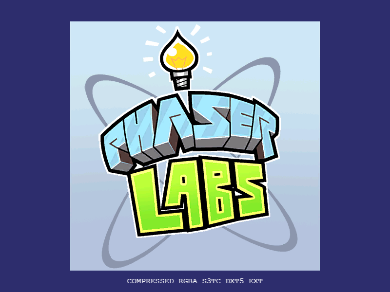

# WebGL Compressed Textures in Phaser

What are WebGL compressed textures? Why should I use them in Phaser? And how do I get the most out of them and avoid common problems? We've put in the research to answer these questions.

This guide assumes you are using [Phaser](https://www.phaser.io), but the principles should be broadly applicable.

> **Cheat Sheet**
>
> Encode a useful set of compressed textures with a single script:
>
> `./compress-texture.sh myImage.png`
>
> See 'Automating Encoding with PVRTexToolCLI and ImageMagick' below for more details on the script.
>
> Or if you want to be a bit more hands-on, here's a manual path to quick success with compressed textures on the Web.
>
> - Generate a texture atlas in TexturePacker, and save it as PNG.
> - Use ImageMagick to lighten the image for hardware compression on the Web: `magick input.png -set colorspace RGB -colorspace sRGB output.png`
> - Use TexturePacker or PVRTexTool to save the lightened image as the following texture formats, in a PVR or KTX container:
>   - ASTC sRGB UNorm 4x4 (or another sample level - don't select a "signed" variant!)
>   - ETC2 sRGBA
>   - PVRTC v1
>   - S3TC DXT5 sRGB (also known as BC3)
> - Select the appropriate format for your target hardware (Phaser will do this automatically)
>
> Most of this document explains what all this stuff means!

## What Are Compressed Textures?

A compressed texture is a data format which is more efficient for the graphics processing unit (GPU) to store and handle. It is typically a _container file_ with some _metadata_ which describes an _internal format_. As these files are optimized for use in a GPU, they are not common container files like PNG or JPG. They don't open in common image file viewers.

A _container file_ is a file format. In this guide we concentrate on PVR and KTX containers which Phaser can use. There are other compressed texture formats, such as DDS and BASIS. There are also other image formats, such as PNG and JPG, which are not WebGL compressed textures.

_Metadata_ is information about what a container contains. This is used when decoding the file.

The _internal format_ is the specific encoding of image data. There are many types of internal format, depending on target hardware, quality, color space, and other variables. We will discuss these later in the guide.

## Why Use Compressed Textures?

Compressed textures are designed to be more compact on the GPU. This means they are faster to access, and use less power. They are perfect for gaming on mobile devices, where power and memory are at a premium. There is some tradeoff for visual quality, but modern texture compression can be very efficient and high-quality.

Compare to a common image format such as PNG or JPG:

| Property             | Compressed Texture | Common Image                     |
|:---------------------|--------------------|----------------------------------|
| Size on GPU          | Smaller            | Larger                           |
| Power efficiency     | More efficient     | Less efficient                   |
| File Size            | Larger             | Smaller                          |
| Download             | Less efficient     | More efficient                   |
| Download compression | More efficient     | Less efficient                   |
| Image quality        | Some loss          | No loss (PNG) to high loss (JPG) |
| Color Brightness     | Linear (dark)      | sRGB (normal)                    |

### Compressed Texture Size

Notice that a compressed texture is actually bigger than common image formats. Why is this?

Consider that an image is actually a grid of data sent to the screen. That grid must exist in the computer before it can be displayed.

Common image files do not contain the grid. They compress it so they are smaller to download. This can be very efficient. The computer must decompress the file to recreate the grid.

Compressed texture files do contain a grid. There is no decompression step, so they are always a certain size. But the grid itself is optimized for efficient display by the GPU.

(We call the data a "grid", but it's actually more complicated than that. Common images are generally stored as individual texels, while compressed textures gain their efficiency by storing regular blocks of related texels. These details are largely irrelevant to actually using the textures, however.)

Fortunately, you can combine compressed textures with other compression techniques. When you are serving your textures from a web server, you can enable **Brotli** or **GZIP compression** to greatly reduce the download size of compressed texture files. This setting depends on your server, but is supported by all modern browsers. Server compression is generally not recommended for common image files, as they are already compressed. However, compressed texture files are not compressed in this way, so they can benefit from these settings.

## How Should I Use Compressed Textures?

Different hardware platforms support different kinds of compressed texture. You should prepare a file for each target platform.

### An Example

Phaser makes it easy to load the correct file for the current platform. There are several examples online at [Phaser Examples/Textures](https://labs.phaser.io/index.html?dir=textures/&q=). Consider the following [example for loading a single texture](https://labs.phaser.io/view.html?src=src%2Ftextures%2Fcompressed%20texture.js):

```js
class Demo extends Phaser.Scene
{
    preload ()
    {
        this.load.texture('labs', {
            'ASTC': 'assets/compressed/compressed/labs-ASTC-4x4-lRGB.pvr',
            'ETC': 'assets/compressed/compressed/labs-ETC2-lRGB.pvr',
            'PVRTC': 'assets/compressed/compressed/labs-PVRTC-4BPP-lRGB.pvr',
            'S3TC': 'assets/compressed/compressed/labs-S3TC-BC3-lRGB.pvr',
            'IMG': 'assets/compressed/uncompressed/labs.png'
        });
    }

    create ()
    {
        const logo = this.add.image(400, 300, 'labs');

        this.add.text(400, 570, logo.frame.source.compressionAlgorithm).setOrigin(0.5, 0);
    }
}

const config = {
    parent: 'phaser-example',
    width: 800,
    height: 600,
    backgroundColor: '#2d2d6d',
    scene: Demo
};

const game = new Phaser.Game(config);
```

This will render something similar to this:



Note the text below the logo. In this case it displays "COMPRESSED RGBA S3TC DXT5 EXT", but it will vary depending on what device runs the code.

Phaser has loaded a single texture, named `labs`. But in the code, there are 5 files listed. How does it know which file to load?

Phaser queries WebGL to determine which compressed texture formats are available on the current hardware. It then looks for the first compatible format in the list, and loads that file.

If no compressed formats are available, Phaser uses a common image, here a PNG. This is listed last, under `IMG`. It is good to always have an IMG image as a fallback, in case nothing else loads.

Here, the files are as follows:

| Priority | Container | Internal Format Family | Filename                      |
|:---------|:----------|:-----------------------|:------------------------------| 
| 1        | PVR       | ASTC                   | labs-astc-4x4.pvr             |
| 2        | PVR       | ETC1                   | labs-etc1.pvr                 |
| 3        | PVR       | PVRTC                  | labs-pvrtc-4bpp-rgba-srgb.pvr |
| 4        | PVR       | S3TC                   | labs-bc3.pvr                  |
| 5        | IMG       | IMG                    | labs.png                      |

We'll explain more about these terms below.

### Target Platforms

You need different internal formats for different hardware platforms. These formats come in various "families", each of which is an individual WebGL extension. WebGL supports the following families, depending on hardware:

| Family | Hardware Support |
|:--|:--|
| ASTC | Modern iOS devices, most Android devices, some Intel desktop GPUs |
| PVRTC | Older iOS devices |
| ETC, ETC1 | Older Android and mobile devices |
| BPTC | Desktops |
| S3TC, S3TCSRGB, RGTC | Desktops |
| ATC | Old AMD devices
| IMG | All web platforms |

This is a rough indication of compatibility only. Real-world hardware can and will vary.

For the widest reach, use one texture for each row, with the following caveats:

- Omit ATC. The format is outdated and has been removed from WebGL.
- Omit BPTC unless you know what you're doing. This is mostly used for high-end HDR textures.
- ETC and ETC1 contain a range of internal formats suited to different color spaces.
- S3TC and S3TCSRGB are very similar. Use the former for linear color, and the latter for sRGB color.
- Most internal formats are for RGB or RGBA color. RGTC and some ETC1 internal formats provide R or RG color, for use in height maps or other data types.

If you know you are targeting only specific hardware, you can reduce the number of files needed accordingly.

## How Do I Create Compressed Textures?

Follow these steps:

1. Create base image
2. Choose container format
3. Choose internal format
4. Decide on MIPMaps
5. Consider brightness
6. Encode file

### Create Base Image

Create an image, or have one created by an artist. You probably want a lossless PNG file at this stage. Check the following important features:

- Does it need an alpha channel?
- What color space does it use: linear, or sRGB?
  - Most files encoded for the Web use sRGB.
- What resolution is the image?
  - Width x Height, e.g. 1280x720.

You might use this PNG file as your fallback IMG, or create a lossy, highly-compressed version for the IMG, which is faster to download.

### Choose Container Format

Phaser supports two container formats: PVR and KTX.

PVR derives from PowerVR texture formats. It has an online [specification](https://docs.imgtec.com/specifications/pvr-file-format-specification/html/index.html), but it is not necessary to read this unless you're actually decoding the file. (We do that for you!) Phaser supports most internal formats available in PVR.

KTX is provided by the Khronos Group, who provide the standards upon which WebGL is based. See https://www.khronos.org/ktx/ for specifics. Because KTX is designed for OpenGL, upon which WebGL is based, it automatically points to the correct internal format.

Either format works well and is supported by common tools.

Note that these formats support the full range of OpenGL options, many of which are not available in WebGL. We will explain the key restrictions going forward.

### Choose Internal Format

Repeat this step for every hardware platform you are targeting.

This is a two-step process:

1. Choose WebGL extension
2. Choose suitable internal format

#### Choose WebGL Extension

This is the "family" mentioned in [Target Platforms](#target-platforms). Select the extension suited to your target hardware.

| Phaser Shorthand | WebGL Extension | Target Platform |
|------------------|:----------------|:----------------|
| ASTC | [WEBGL_compressed_texture_astc](https://registry.khronos.org/webgl/extensions/WEBGL_compressed_texture_astc/) | Modern mobile
| ATC | [WEBGL_compressed_texture_atc](https://registry.khronos.org/webgl/extensions/rejected/WEBGL_compressed_texture_atc/) (removed) | Old AMD mobile
| BPTC | [EXT_texture_compression_bptc](https://registry.khronos.org/webgl/extensions/EXT_texture_compression_bptc/) | Desktop and HDR
| ETC | [WEBGL_compressed_texture_etc](https://registry.khronos.org/webgl/extensions/WEBGL_compressed_texture_etc/) | Older Android
| ETC1 | [WEBGL_compressed_texture_etc1](https://registry.khronos.org/webgl/extensions/WEBGL_compressed_texture_etc1/) | Older Android
| IMG | None | Fallback for all devices
| PVRTC | [WEBGL_compressed_texture_pvrtc](https://registry.khronos.org/webgl/extensions/WEBGL_compressed_texture_pvrtc/) | Older iOS
| RGTC | [EXT_texture_compression_rgtc](https://registry.khronos.org/webgl/extensions/EXT_texture_compression_rgtc/) | Desktop (reduced color channels)
| S3TC | [WEBGL_compressed_texture_s3tc](https://registry.khronos.org/webgl/extensions/WEBGL_compressed_texture_s3tc/) | Desktop (linear color)
| S3TCSRGB | [WEBGL_compressed_texture_s3tc_srgb](https://registry.khronos.org/webgl/extensions/WEBGL_compressed_texture_s3tc_srgb/) | Desktop (sRGB color)

If you are using **S3TC** compression, **choose** either linear or sRGB color! They are split into S3TC and S3TCSRGB families.

If you are using **ETC1** compression, **check** whether ETC might be a better choice! ETC, confusingly, supports ETC2 and EAC formats, adding support for alpha channels, R and RG textures, and linear or sRGB color spaces.

#### Choose Suitable Internal Format

You can now choose a suitable internal format from those provided by the WebGL extension you have chosen. However, this choice is probably made for you by the tool you are using to encode the image.

These tools **do not check everything**! You can create invalid files which WebGL will reject. Phaser will try to check for invalid data and log it in the browser console, but if you follow the guidelines below, you should avoid errors.

- Check resolution
- Check color space

##### Check Resolution

Most formats have no restrictions on texture resolutions. It is a good idea to use a maximum resolution of 4096 pixels, as higher resolutions may not be supported on mobile devices.

The PVRTC extension requires that resolutions be a "power-of-two". That is, width and height must each be one of `1, 2, 4, 8, 16, 32, 64, 128, 256, 512, 1024, 2048, 4096`.

The S3TC, S3TCSRGB, RGTC, and BPTC extensions require that resolutions be a multiple of 4.

The absolutely safest resolutions are power-of-two. All WebGL extensions support these resolutions in all modes.

##### Check Color Space

Select the appropriate color space. This can be **linear**, or **sRGB**. However, some use cases might use only 1 or 2 color channels: R and RG respectively.

sRGB color is the best choice, because it offers more detail in brighter frequencies, where the eye is most sensitive. The Web uses sRGB color for just about everything. See https://imagemagick.org/Usage/color_basics/#srgb for more details on color spaces.

The sRGB color space is supported by ASTC, ETC, and S3TC (as S3TCSRGB). However, PVRTC does not support sRGB color; you must use linear color.

### Decide on MIPMaps

MIPMaps are scaled-down copies of your texture. These are useful for using the texture at low detail or low size. Each MIPMap level is typically half the resolution of the level above it, all the way down to 1 pixel.

WebGL **requires all MIPMap levels to have power-of-two resolution**. It will reject levels which are any other resolution. This can be a source of confusing error messages. From version 3.80, Phaser rejects textures which have invalid MIPMaps, even if the base level is valid, because this reflects an improper texture which could cause glitches at an unexpected moment.

In addition, S3TCSRGB requires MIPMap levels to have a resolution of 0, 1, 2, or a multiple of 4. However, the power-of-two restriction is stronger than this, so do not worry about it.

Phaser **does not use MIPMaps** by default. They are only relevant if you set a non-default texture filter in the game config. Textures intended for 3D applications are another matter, and MIPMaps are recommended.

If you intend to use MIPMaps, you must use power-of-two resolutions. You may need to go back to the base texture.

If you do not intend to use MIPMaps, ensure that your texture tool has them turned off. Unnecessary MIPMaps will add 33% to your compressed texture file size, as well as all the other restrictions that come with them.

> TexturePacker does not generate MIPMaps. This is good. TexturePacker creates texture atlases which combine many images into a single texture, and MIPMaps would start to blur one image into another, causing visual glitches.

### Create Lightened Image

If you encode now, your texture will appear unexpectedly dark. This is because of the interaction between the Web's sRGB color space, and the linear color that WebGL extracts from compressed textures in hardware.

The easiest way to fix this is to encode the file with PVRTexTool (see Encode File below). You can also lighten the file prior to encoding e.g. with ImageMagick.

This should only be necessary for use on the Web. Other rendering environments may be able to automatically adjust the colorspace of hardware compressed textures. However, this is not possible in WebGL.

#### Lightening with ImageMagick

If you can't use PVRTexTool to encode your images, you may need to lighten them earlier in the pipeline. The simplest solution is to create a lightened version of your base image.

You can do this with ImageMagick (https://imagemagick.org/index.php) using the following command:

```
magick input.png -set colorspace RGB -colorspace sRGB output.png
```

> This may cause a loss of quality, due to intermediate steps. It's recommended to encode your images directly using PVRTexTool.

### Encode File

Now it is time to encode your compressed texture file. The precise steps will depend on the tool you are using. Two very useful tools are:

- TexturePacker (https://www.codeandweb.com/texturepacker)
- PVRTexTool (available with a free account at https://developer.imaginationtech.com/pvrtextool/)

We recommend using TexturePacker to pack textures into PNG atlases, then using PVRTexTool to encode the atlases.

#### TexturePacker

TexturePacker lets you assemble images together into texture atlases.

A texture atlas is more efficient than single image files, because the GPU doesn't like swapping textures while it is rendering. If the textures are all in a single atlas, or in a few atlases, the GPU doesn't have to switch as often, and your game will render faster.

You should use TexturePacker to generate a base image PNG, prior to encoding it.

When you are ready, press the "Publish sprite sheet" button to write out a file. TexturePacker will also output a JSON file describing where images are located in the atlas texture.

You can also use TexturePacker to encode a single texture, such as a file manually lightened with ImageMagick. Just make sure to turn off all extrude and margin settings, so the texture stays the same. It is safe to turn on options that increase the size of the texture, e.g. enforcing power-of-two resolution, so long as the image stays in the top-left corner.

TexturePacker doesn't generate MIPMaps.

To output a compressed texture, see the `Texture` tab in the GUI. Here you can select a range of file types, including PVR and KTX. As of version 7.1.0, TexturePacker offers the following relevant options:

| Option | WebGL Extension | sRGB support? | Transparency? |
|:---|---|:---|:---|
| PVRTCI 2bpp RGBA | PVRTC | n | Y |
| PVRTCI 4bpp RGBA | PVRTC | n | Y |
| PVRTCI 2bpp RGB | PVRTC | n | n |
| PVRTCI 4bpp RGB | PVRTC | n | n |
| ETC1 RGB | ETC1 | Y | n |
| ETC2 RGB | ETC | Y | n |
| ETC2 RGBA | ETC | Y | Y |
| ETC2 RGB | ETC | Y | n |
| DXT1/BC1 | S3TC/S3TCSRGB | Y | n |
| DXT5/BC3 | S3TC/S3TCSRGB | Y | Y |
| ASTC/4x4 | ASTC | Y | Y |
| ASTC/5x4 | ASTC | Y | Y |
| ASTC/5x5 | ASTC | Y | Y |
| ASTC/6x5 | ASTC | Y | Y |
| ASTC/6x6 | ASTC | Y | Y |
| ASTC/8x5 | ASTC | Y | Y |
| ASTC/8x6 | ASTC | Y | Y |
| ASTC/8x8 | ASTC | Y | Y |
| ASTC/10x5 | ASTC | Y | Y |
| ASTC/10x6 | ASTC | Y | Y |
| ASTC/10x8 | ASTC | Y | Y |
| ASTC/10x10 | ASTC | Y | Y |
| ASTC/12x10 | ASTC | Y | Y |
| ASTC/12x12 | ASTC | Y | Y |

Note: selecting DXT1/BC1 or DXT5/BC3 requires you to understand whether you're using linear or sRGB color when loading files into Phaser. Whichever you choose, DXT5 is recommended.

Note: PVRTC does not offer sRGB support, and must have a power-of-two resolution.

Note: PVRTCII and ETC1 A are listed in TexturePacker, but are not supported in WebGL.

Note: Other internal formats are listed, but not supported.

There are other options related to quality and image encoding; it is generally safe to leave these as they are.

You can also use TexturePacker on the command line, to automate your workflow.

#### PVRTexTool

PVRTexTool lets you see exactly what is going on inside a compressed texture. It also supports a wider range of output internal formats, allows you to generate MIPMaps, and perform other useful operations on a texture. However, it does not provide texture atlas generation.

When you open an image in PVRTexTool, it will display some key information. This is summarized under the "info" button in the top right. It will show you the following information:

- Dimensions
- Pixel Format
- Channel Type
- Colour Space
- MIP Levels
- Faces
- Array Surfaces
- Data Size
- X Axis
- Y Axis
- Z Axis

This data is very useful in checking a compressed texture file, ensuring that everything is set the way you expect.

Some of the data here is irrelevant to Phaser. Compressed texture files support many additional features, such as cube maps, image arrays, and 3D textures.

To convert a base texture into a compressed texture, select Encode on the left or under the Edit menu. This will display a large list of options.

The most helpful option is to click "Group/API" and select "Vulkan". This displays a list of all internal formats. It also offers filters, so you can select the appropriate color space and transparency settings. The following options are relevant:

| Entry begins with | WebGL Extension | Notes |
|:---|---|:---|
| PVRTC | PVRTC | Not PVRTCII
| BC1 | S3TC/S3TCSRGB | 1-bit alpha
| BC2 | S3TC/S3TCSRGB | Sharp, explicit alpha
| BC3 | S3TC/S3TCSRGB | Gradient, interpolated alpha (recommended)
| ETC2 | ETC | ETC1 support can be found under OpenGL ES 1
| EAC | ETC | R or RG channels
| ASTC | ASTC | Do not use "Signed Floating Point" formats in WebGL

The Encode window also allows you to automatically generate MIPMaps. **Check** whether you want to do this! Remember that MIPMaps should only be used when necessary, and that they must have a power-of-two resolution under WebGL.

When you are satisfied with your options, hit "Encode", and then save or save-as the file.

Note that the PVRTexTool UI has no place to specify that the input is sRGB. You must either lighten the image before processing, or use the command line to enable this option.

PVRTexTool also supports command-line automation. Consult the online documentation for usage, or see below for a script that can handle it for you.

#### Unsupported Formats

Neither TexturePacker nor PVRTexTool support some of the available options. We haven't figured out how to make BPTC or RGTC compressed textures yet.

For more information on WebGL compressed texture support, view the extension notes at https://registry.khronos.org/webgl/extensions/. Note that this is quite technical. Most texture compression extensions begin with `WEBGL_compressed_texture_`, but some begin with `EXT_texture_compression_`.

#### Good File Naming Practice

You will quickly make a lot of versions of every base texture. It's a good idea to pick a file naming system at the beginning, and stick to it.

One such system is as follows:

```
key-family-option-colorspace-mip
```

- `key` is the unique identifier for the file, e.g. "title" or "monster". The base texture is named with just the key.
- `family` is the WebGL extension you are using, as used when loading it into Phaser, e.g. "ASTC", "PVRTC", "ETC", "S3TC", or "IMG". Don't forget to copy the base texture to the IMG variant!
- `option` is an optional value which might be useful for clarifying the family, e.g. an ASTC texture might specify "4x4", or an S3TC texture might specify "BC3".
- `colorspace` is the color space, either "LINEAR" or "sRGB".
- `mip` is whether the image has MIPMaps, either "MIP" or "NOMIP". This is irrelevant for IMG files.

So you might wind up with the following files:

- `title.png`
- `title-lightened.png` (if you need an intermediate lightening step)
- `title-IMG-sRGB.png`
- `title-ASTC-4x4-sRGB-NOMIP.pvr`
- `title-ETC-RGBA-sRGB-NOMIP.pvr`
- `title-PVRTC-2bppRGBA-NOMIP.pvr`
- `title-S3TC-BC3-sRGB-NOMIP.pvr`

## Automating Encoding with PVRTexToolCLI and ImageMagick

You can automate texture encoding from the command line. We've written a script to encode recommended formats.

The following `bash` command looks for `./myImage.png`, and creates encodings in the same location.

```sh
./compress-texture.sh myImage.png
```

On Windows you may need to use `./compress-texture.sh <filename> use_exe`, even if you're in Windows Subsystem for Linux (WSL).

Make sure you have installed the following, and they are available in the path on your command line:

- ImageMagick (specifically `identify`)
- PVRTexTool (specifically `PVRTexToolCLI`)

It creates the desired encodings:

- ASTC
- ETC2
- PVRTC
- BC3 (S3TC)

The script uses `identify` to check whether the resolution matches the more demanding formats. If it doesn't match, it will pad the formats to match. Beware: this can change the size of textures!

It runs `PVRTexToolCLI` to do the encoding in a single step. You **do not need to lighten the image** for this script to work. It generates a command similar to this:

```sh
PVRTexToolCLI -i ./myImage.png -o ./myImage-S3TC-BC3-lRGB.pvr -p -flip y,flag -ics lRGB -f BC3 -rCanvas 1024,1024
```

- `-i`: input file
- `-o`: output file
- `-p`: premultiply alpha
- `-flip y,flag`: Flip the image vertically (this is necessary for Phaser 4)
- `-ics lRGB`: treat the input color space as linear, so we don't need to lighten it
- `-f`: target encoding format
- `-rCanvas`: resize canvas (necessary for the BC3 encoding)
- `-q`: quality level for other encoding types (we set it to maximum, which runs slow but produces good results)
- `-potcanvas +`: allow the canvas to resize to a power of 2 (necessary for the PVRTC encoding)

You may want to create variants of the script for other targets. Phaser 4 uses premultiplied alpha and a flipped Y axis to be compatible with WebGL, but other rendering systems may want different inputs.

## Now Make Games!

We hope this guide is a helpful reference to creating WebGL compressed textures. It's mostly pretty simple, if you follow the guidelines. Go forth and have fun!
